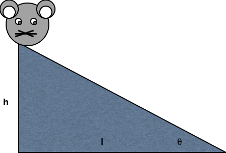
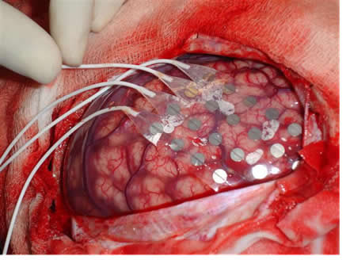
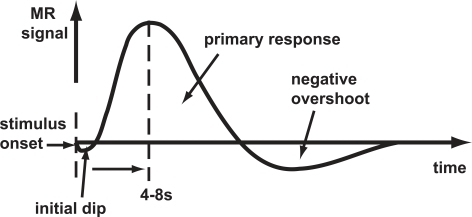
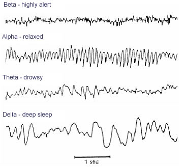
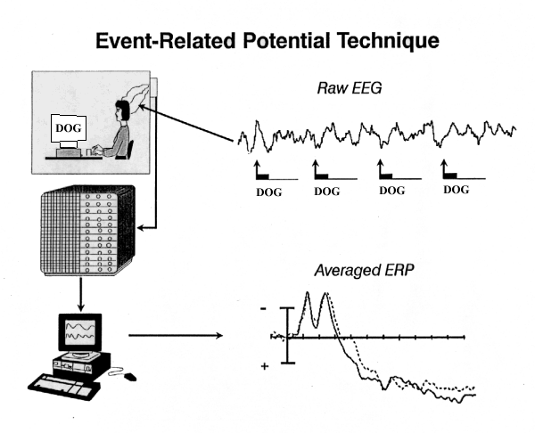
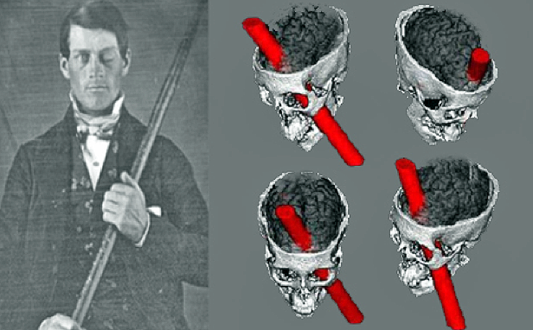

```{r set-up, echo=FALSE, error=FALSE, include=FALSE, warning=FALSE, message=FALSE}
path2figs = '../figs'
knitr::opts_chunk$set(fig.path=path2figs, fig.width = 8.5)
```

## PSY 511 {.flexbox .vcenter}

### Foundations of Cognitive and Affective Neuroscience

<div class="centered">


#### Rick O. Gilmore, Ph.D.</br>
Associate Professor of Psychology
</div>

## Why neuroscience is harder than physics {.flexbox .vcenter}

<div class="centered">

</div>

## Why neuroscience is harder than physics {.flexbox .vcenter}

<div class="centered">

</div>

## What do we need to know to answer the question?

### A. What is the wedge made of?
### B. What happened to the mouse recently? 
### C. The mouse’s sex or age?
### D. The mouse’s state (hungry, horny, asleep)
### E. Mouse’s genetic strain

## This course is about...

## Genes {.flexbox .vcenter}

<div class="centered">


<http://ecx.images-amazon.com/images/I/41OzMnt3lpL._SX319_BO1,204,203,200_.jpg>
</div>

## Neurotransmitters {.flexbox .vcenter}

<div class="centered">

<http://rlv.zcache.com/blame_my_neurotransmitters_if_not_paying_attention_mousepad-p144383961261005279trak_400.jpg>
</div>

## Neurons {.flexbox .vcenter}

<div class="centered">

<http://www.biolegend.com/NewsLegend/032515blog/neuron_cartoon.jpg>
</div>

## Networks

<div class="centered">


<https://s-media-cache-ak0.pinimg.com/236x/a9/94/3a/a9943ae81a965e483227b6f9f5e7ca5f.jpg>
</div>

## Brains {.flexbox .vcenter}

<div class="centered">


<http://unearthedcomics.com/wp-content/uploads/2012/12/Unearthed-BrainWandering-1211-2-web.jpg>
</div>

## Behavior {.flexbox .vcenter}

<div class="centered">

<http://www.glasbergen.com/wp-content/gallery/teen/edu01.gif>
</div>

## Goals

- Master fundamentals of neuroscientific concepts and facts
- Prepare to read primary source literature in behavioral, cognitive, affective, and clinical neuroscience

## Course structure

<https://github.com/psu-psychology/psy-511-scan-fdns>

## What is the basic plan of the nervous system?

- Neuroanatomy
- Rooted in behavior, evolution, development

## Approach

- How do neurons and networks achieve behavioral goals?
- Information processing or computing

## Approach

### What do animals (and people) do?

- Have to
- Choose to

### What’s the information required?

- Input 
- Computation/processing
- Output

## Approach

### Brain architecture (neuroanatomy)
### Brain function (neurophysiology)
### Brain communication (neurochemistry)
### Changes over evolutionary and developmental time
  
## What is neuroscience?

### The study of the nervous system
- And the behavior it makes possible

### Questions
- What are the parts of the nervous system?
- How do the parts work?  What do they do?
- Where did they come from?
  
## Your turn

- What are the main categories of behavior we want to understand?
- [Papers you want to read](https://github.com/psu-psychology/psy-511-scan-fdns/blob/master/handouts/papers-we-want-2-understand.md)

## Your turn, Part II
- How do the behaviors you picked fit with the prior framework?
- Describe the main
  + Inputs
  + Outputs
  + Computations

## Biological imperatives

### Sustenance
- Eating & drinking

### Protection
- Act or rest
- Fight, flee, hide, freeze

### Reproduction
- Mate seeking
- Territory protection, nest-building 
- Mating
- Caregiving

## Brain architecture for enacting biological imperatives {.flexbox .vcenter}

<div class="centered">

</div>

## Neuroscience methods

- Methods to the madness
- Tools in the neuroscientist’s toolkit
- What they tell us, and what they don’t

## Evaluating methods 

### What is the question?

### What are we measuring?

- Structure
- Activity

### Strengths & Weaknesses

- Cost
- Invasiveness
- Spatial/temporal resolution

## Spatial resolution {.flexbox .vcenter}

<div class="centered">


<http://ai.ato.ms/MITECS/Images/churchland.figure1.gif>
</div>

## Types of methods

### Structural
- Mapping the circuitry
- Anatomy

### Functional
- What does it do?
- Physiology/Activity

## Mapping structures

- Cell/axon stains
- Golgi stain -- whole cells
- Cellular distribution, concentration, microanatomy

<div class="centered">


<http://connectomethebook.com/wp-content/uploads/2011/11/Brainforest17_1119.jpg>
</div>

### Retrograde vs. anterograde tracers
- What connects where

<div class="centered">


<http://openi.nlm.nih.gov/imgs/512/348/3176268/3176268_1471-2105-12-351-2.png>
</div>

## Mapping structures

- Computed axial tomography (CAT), CT
- X-ray based

<div class="centered">


<http://img.tfd.com/mk/T/X2604-T-22.png>
</div>

## Tomography {.flexbox .vcenter}

<div class="centered">


<http://static.howstuffworks.com/gif/cat-scan-pineapple.jpg>
</div>

## Magnetic Resonance Imaging

- Magnetic resonance
- Protons have spin (magnetic dipole)
- Align with strong magnetic field
- When perturbed, speed of realignment varies by tissue
- Realignment gives off radio frequency signals

## MRI {.flexbox .vcenter}

<div class="centered">


<http://s.hswstatic.com/gif/mri-steps.jpg>
</div>

## Structural MRI

- Tissue density/type differences
- Gray vs. white - Axon fibers
- Spectroscopy
- Region sizes/volumes

## Functional methods

- Recording from the brain 
- Interfering with the brain 
- Stimulating the brain

## Recording from the brain

- Single/multi unit recording
- Microelectrodes
- Small numbers of nerve cells

## Single/multi-unit Recording {.flexbox .vcenter}

<div class="centered">


<http://www.nature.com/nrn/journal/v5/n11/images/nrn1535-i1.jpg>
</div>

## Single/multi-unit recording

- What does neuron X respond to?
- Great temporal (ms), spatial resolution (um)
- Invasive
- Rarely suitable for humans, but...

## Electrocorticography {.flexbox .vcenter}

<div class="centered">


<http://www.neurofisiologia.net/wp-content/uploads/2009/07/corticografia.jpg>
</div>

## Single-cell studies ask...

- How does firing frequency, timing vary with behavior?

## Positron Emission Tomography (PET)

- Radioactive tracers (glucose, oxygen)
- Positron decay
- Experimental condition - control
- Average across individuals

## More on PET

- Temporal (~ s) and spatial (mm-cm) resolution worse than fMRI
- Radioactive exposures + mildly invasive 
- Dose < airline crew exposure in 1 yr

## Functional Magnetic Resonance Imaging (fMRI)

- Neural activity -> local O2 consumption increase
- Blood Oxygen Level Dependent (BOLD) response
- Oxygenated vs. deoxygenated hemoglobin
- Do regional blood O2 levels (and flow) vary with behavior X?
- Non-invasive, but expensive
- Moderate but improving (mm) spatial, temporal (~sec) resolution
- Hemodynamic Response Function
- 1s delay plus 3-6 s ramp-up

## Hemodynamic Response Function (HRF)

<div class="centered">


<http://openi.nlm.nih.gov/imgs/512/236/3109590/3109590_TONIJ-5-24_F1.png>
</div>

## Electroencephalography (EEG)

- How does it work?
- Electrodes on scalp or brain surface
- What do we measure?
- Combined activity of huge # of neurons

## Collecting EEG {.flexbox .vcenter}

<div class="centered">


<http://sfari.org/images/images-2013-folder/images-sfn-2013/20131110sfneeg>
</div>

## EEG

- High temporal, poor spatial resolution
- Analyze frequency bands
  + LOW: deep sleep
  + MIDDLE: Quiet, alert state
  + HIGH:“Binding” information across senses
  
## EEG Frequency {.flexbox .vcenter}

<div class="centered">


<http://www.peakmind.co.uk/images/frequency.jpg>
</div>

## Event-related potentials (ERPs)

- EEGs time-locked to some event - Averaged over many trials

## ERP {.flexbox .vcenter}

<div class="centered">

<http://2.bp.blogspot.com/_2ob-1_LsjJs/TAUjw9i_dYI/AAAAAAAAAQQ/9AfiHsnD-P8/s1600/ERP_technique.gif>
</div>

## Magneto-encephalography (MEG)

- Like EEG, but measuring magnetic fields
- High temporal resolution
- Magnetic field propagates w/o distortion

## MEG {.flexbox .vcenter}

<div class="centered">

<http://www.massgeneral.org/psychiatry/assets/images/Magnetoencephalography_MEG_MGH.jpg>
</div>

## How do EEG and fMRI relate? {.flexbox .vcenter}

<div class="centered">

</div>

## Manipulating the brain

- Interfering with it 
- Stimulating it

## Interfering with the brain

- Nature’s“experiments” 
- Stroke, head injury, tumor
- Neuropsychology

## Phineas Gage {.flexbox .vcenter}

<div class="centered">

<http://onlinestorybank.com/wp-content/uploads/2014/03/Phineas-Gage.png>
</div>

## Evaluating neuropsychological methods

- Logic: damage impairs performance = region critical for behavior
- Poor spatial/temporal resolution, limited control

##Stimulating the brain

- Electrical (Direct Current Stimulation - DCS)
- Pharmacological
- Magnetic (Transcranial magnetic stimulation-TMS)

## Stimulating the brain

- Spatial/temporal resolution?
- Assume stimulation mimics natural activity?

## Deep brain stimulation as therapy

- Parkinson’s Disease 
- Depression 
- Epilepsy

## {.flexbox .vcenter}

<div class="centered">

<http://www.nimh.nih.gov/images/health-and-outreach/mental-health-topic-brain-stimulation-therapies/dbs_60715_3.jpg>
</div>which 

## Simulating the brain

- Computer/mathematical models of brain function
- Example: neural networks
- Cheap, noninvasive, can be stimulated or “lesioned”

## Main points

- Multiple structural, functional methods
- Different levels of spatia