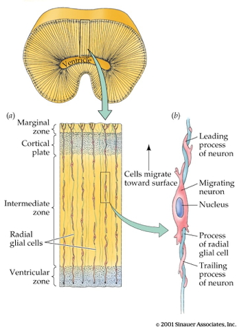
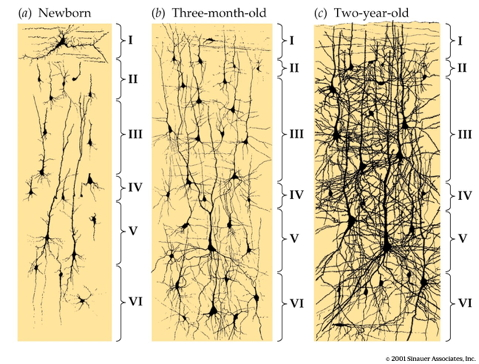
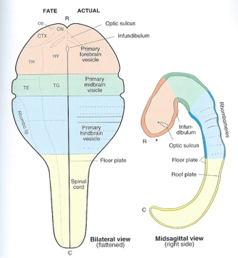
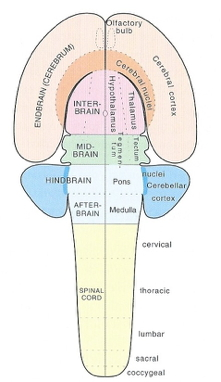

## Today's Topics

- The evolution and development of the nervous system

## Ontogenesis and phylogenesis

- Ontogenesis
    + Development within lifetimes, history of individuals
- Phylogenesis
    + Change across lifestimes, history of species

## Ontogeny does not recapitulate phylogeny (Haeckel), but...

<https://upload.wikimedia.org/wikipedia/commons/thumb/0/08/Haeckel_drawings.jpg/350px-Haeckel_drawings.jpg>

## Complex multicellular life emerged "recently"

<http://www.zo.utexas.edu/faculty/sjasper/images/26.2.gif>

## Time scales

<http://www.indiana.edu/~geol105b/images/gaia_chapter_6/time_scale.gif>

## Evolution alters developmental programs

## Nervous system architectures

<http://sites.sinauer.com/animalphys3e/boxex/AnPhys3e-BoxEx-15-01-0.jpg>

## An animal with a nerve "net"

<iframe width="420" height="315" src="https://www.youtube.com/embed/-UI531GMRTM" frameborder="0" allowfullscreen></iframe>

## How nervous systems differ

- Body symmetry
    + radial
    + bilateral
- Segmentation
- Cephalization
- Encasement in bone (vertebrates)
- Centralized vs. distributed function

## Cephalopods have "intelligent arms"

<iframe width="700" height="400" src="http://www.sciencedirect.com/science/article/pii/S0022098113000683" frameborder="0" allowfullscreen></iframe>

## Biological imperatives

- Ingestion
- Defense
- Reproduction

## Information processing schematic

## Information processing universals

- Sense/detect
    + Sensors
- Analyze, evaluate, decide
- Act
    + Effectors
    + e.g., approach/avoid, manipulate, signal

## Sensors

- Specialize by information source/type
- Specialize by target location
    + Interoceptive
    + Exteroceptive
    
## Analysis, evaluation, decision

- Current state
    + World
    + Organism
- Current goals
- Past state(s)

## Effectors

- Move body
- Send signals
- Change physiological state

## Evolutionary trends in cortical size

[@hofman_evolution_2014]

## Evolutionary trends in cortical size

| Structural measure | Non-human comparison | Human |
|--------------------|----------------------|-------|
| Cortical gray matter %/tot brain vol | insectivores 25% | 50% |
| Cortical gray + white | mice 40% | 80% |
| Cerebellar mass | primates, mammals 10-15% | 10-15% |

## Evolutionary trends in cortical size

[[@rakic2009evolution]](http://dx.doi.org/10.1038/nrn2719)

## Evolutionary trends in primate brain size

[[@hofman_evolution_2014]](http://journal.frontiersin.org/article/10.3389/fnana.2014.00015/full)

## Human brains have

- Significant "folding"
- Dense interconnections
- Large "association" areas

## How did the system get this way?

## Insemination

- 3-4 days before or up to 1-2 days after...
    + Ovulation

## Fertilization

- Within ~ 24 hrs of ovulation

## Implantation

- ~ 6 days after fertilization

## Early embryogenesis

<iframe width="560" height="315" src="https://www.youtube.com/embed/dAOWQC-OBv0" frameborder="0" allowfullscreen></iframe>

## Formation of neural tube (neurulation)

- Ectoderm, mesoderm, endoderm
- ~18-26 days
- Failures of neural tube closure
    + Spina bifida
    + Anencephaly
- Neural tube becomes
    + Ventricles
    + Central canal of spinal cord

## Neurogenesis and gliogenesis

- Stem cells along ventricles
- Symmetric cell division
- Asymmetric cell division

## Radial glia

## Cell migration

## Radial unit hypothesis

[[@rakic2009evolution]](http://dx.doi.org/10.1038/nrn2719)

## Migration

<iframe width="420" height="315" src="https://www.youtube.com/embed/ZRF-gKZHINk" frameborder="0" allowfullscreen></iframe>

## Migration

<iframe width="420" height="315" src="https://www.youtube.com/embed/t-8bxeWqSV4" frameborder="0" allowfullscreen></iframe>

## Glial migration

<http://physrev.physiology.org/content/81/2/871>

## Axon growth cone

<iframe width="420" height="315" src="https://www.youtube.com/embed/Fgmt2RBow0I" frameborder="0" allowfullscreen></iframe>

## Axons follow

- Chemoattractants
    + e.g., Nerve Growth Factor (NGF)
- Chemorepellents
- Receptors in growth cone detect chemical gradients

## Differentiation

- Neuron vs. glial cell
- Cell type
- NTs released
- Where to connect

## Differential gene expression

[[johnson2009functional]](http://dx.doi.org/10.1016/j.neuron.2009.03.027)

## Prefrontal vs. Other Ctx

[[johnson2009functional]](http://dx.doi.org/10.1016/j.neuron.2009.03.027)

## Synaptogenesis

## Postnatal patterns of synaptogenesis

## Proliferation, pruning

- Early proliferation
- Later pruning
- Rates, peaks differ by area

## Apoptosis

- 20-80%, varies by area
- Spinal cord >> cortex

## Apoptosis and cortical expansion

[[@rakic2009evolution]](http://dx.doi.org/10.1038/nrn2719)

## Synaptic rearrangement

## Myelination

<http://d6igaq6njxgjh.cloudfront.net/content/physrev/81/2/871/F6.large.jpg>

## Myelination

- Neonatal brain largely unmyelinated
- Gradual myelination, peaks in mid-20s
- Spinal cord before brain
- Sensory before motor

## Myelination across human development

[@Hagmann02112010]

## Myelination changes "network" properties

[@Hagmann02112010]

## Synaptic rearrangment, myelination change cortical thickness

- [@gogtay2004dynamic]
- Areal differences in cortical thickness change

## [@gogtay2004dynamic]

<iframe width="420" height="315" src="http://www.pnas.org/content/suppl/2004/05/13/0402680101.DC1/02680Movie1.mpg" frameborder="0" allowfullscreen></iframe>

## [@gogtay2004dynamic]

<iframe width="420" height="315" src="http://www.pnas.org/content/suppl/2004/05/13/0402680101.DC1/02680Movie2.mpg" frameborder="0" allowfullscreen></iframe>

## [@gogtay2004dynamic]

<iframe width="420" height="315" src="http://www.pnas.org/content/suppl/2004/05/13/0402680101.DC1/02680Movie3.mpg" frameborder="0" allowfullscreen></iframe>

## [@gogtay2004dynamic]

<iframe width="420" height="315" src="http://www.pnas.org/content/suppl/2004/05/13/0402680101.DC1/02680Movie4.mpg" frameborder="0" allowfullscreen></iframe>

## Human brain development take homes

- Prenatal
    + Neuro- and gliogenesis
    + Migration
    + Synaptogenesis begins
    + Differentiation
    + Apoptosis
    + Myelination begins
    + Infant gene expression ≠ Adult
    
## Human brain development take homes

- Postnatal
    + Synaptogenesis
    + Cortical expansion, activity-dependent change
    + Myelination
    + Prolonged period of postnatal/pre-reproductive development [@konner_evolution_2011]
    
## How brain development clarifies anatomical structure

## 3-4 weeks

## 4 weeks

<https://upload.wikimedia.org/wikipedia/commons/4/4c/4_week_embryo_brain.jpg>

## ~4 weeks

## 6 weeks

<https://upload.wikimedia.org/wikipedia/commons/thumb/3/33/6_week_human_embryo_nervous_system.svg/500px-6_week_human_embryo_nervous_system.svg.png>

## ~6 weeks

## Beyond

## Organization of the brain

| Major division | Ventricular Landmark | Embryonic Division | Structure       |
|----------------|----------------------|--------------------|-----------------|
| Forebrain      | Lateral              | Telencephalon      | Cerebral cortex |
|                |                      |                    | Basal ganglia   |
|                |                      |                    | Hippocampus, amygdala |
|                | Third                | Diencephalon       | Thalamus        |
|                |                      |                    | Hypothalamus    |
| Midbrain       | Cerebral Aqueduct    | Mesencephalon      | Tectum, tegmentum |

## Organization of the brain

| Major division | Ventricular Landmark | Embryonic Division | Structure         |
|----------------|----------------------|--------------------|-------------------|
| Hindbrain      | 4th                  | Metencephalon      | Cerebellum, pons  |
|                | --                   | Mylencephalon      | Medulla oblongata |

## References {.smaller}
