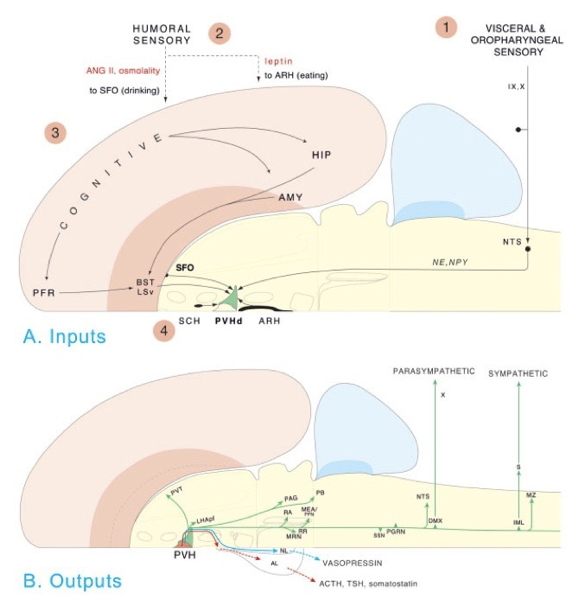
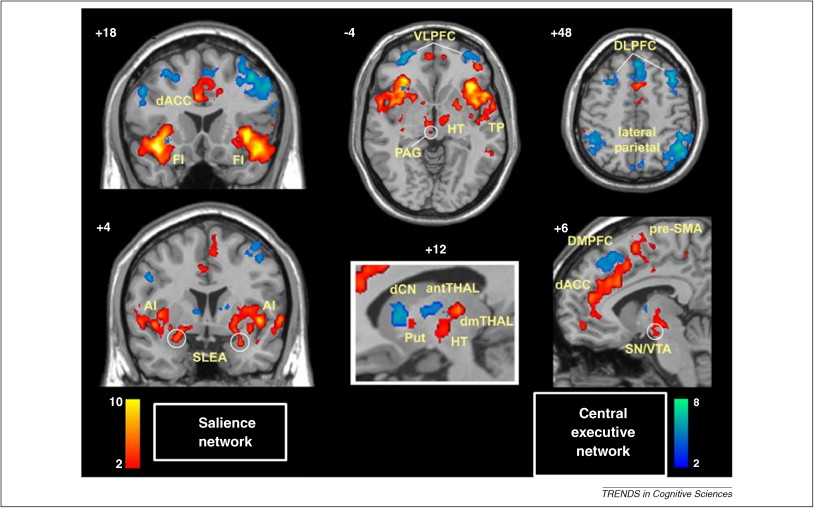
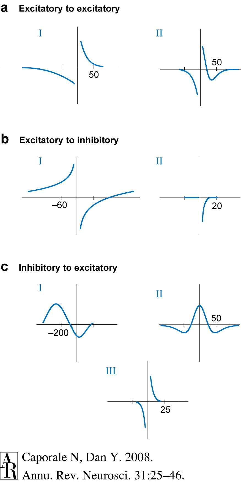
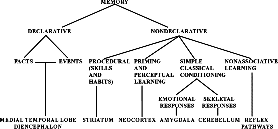

## Today's Topics

- Cognition

## Hierarchy of control

[[@swanson2005anatomy]](http://dx.doi.org10.1002/cne.20733)

## Functional segregation

[[@swanson2005anatomy]](http://dx.doi.org10.1002/cne.20733)

## Do what, where, how?

[[@swanson2012brain]](https://books.google.com/books?hl=en&lr=&id=tAk8Rr00kykC&oi=fnd&pg=PP2&dq=larry+swanson+book&ots=5F7nEnts45&sig=DJLKh5BF_8aVqpOdK28Qmh1wr5Q#v=onepage&q=larry%20swanson%20book&f=false)

## Facets of cognition

- Perception
- Attention
- Imagery

## Facets of cognition

- Learning and conditioning
- Memory
    + Episodic
    + Semantic
    + Procedural
- Language

## Facets of cognition

- Thinking
- Problem solving
- Decision making
- Motivation

## Cognition and the cerebral cortex

[[@swanson2012brain]](https://books.google.com/books?hl=en&lr=&id=tAk8Rr00kykC&oi=fnd&pg=PP2&dq=larry+swanson+book&ots=5F7nEnts45&sig=DJLKh5BF_8aVqpOdK28Qmh1wr5Q#v=onepage&q=larry%20swanson%20book&f=false)

## Cortical schema

- Areas
    + Unimodal sensory
    + Polymodal association
    + Motor
- Connections
    + Association
    + Commissural

## Cortical areas
    

[[@swanson2012brain]](https://books.google.com/books?hl=en&lr=&id=tAk8Rr00kykC&oi=fnd&pg=PP2&dq=larry+swanson+book&ots=5F7nEnts45&sig=DJLKh5BF_8aVqpOdK28Qmh1wr5Q#v=onepage&q=larry%20swanson%20book&f=false)

## Cortical schema

- Columnar structure
- Cytoarchitectonic differerences (e.g. Brodmann)

## Cortical columns

<https://upload.wikimedia.org/wikipedia/commons/thumb/5/5b/Cajal_cortex_drawings.png/518px-Cajal_cortex_drawings.png>

## Cortical layers

<http://s27.photobucket.com/user/caiomaximino/media/layerscortex.jpg.html>

## Cortical connections by layer

- I:
- II: *Efferent*: Ipsilateral association
    + Large pyramidal cells
- III: *Efferent*: Contralateral commissural
- IV: *Afferent*: Thalamus
    + Small stellate, granule
    + Sub-layers in V1
    
## Cortical connections by layer

- V: *Efferent*: Basal ganglia, brainstem, spinal cord: Pyramidal cells
    + Superficial -> Striatum
    + Deep -> Brainstem, spinal cord
- VI: *Efferent*: Thalamus

## Cortical circuit schematic

[[@swanson2012brain]](https://books.google.com/books?hl=en&lr=&id=tAk8Rr00kykC&oi=fnd&pg=PP2&dq=larry+swanson+book&ots=5F7nEnts45&sig=DJLKh5BF_8aVqpOdK28Qmh1wr5Q#v=onepage&q=larry%20swanson%20book&f=false)

## Behavioral control column

[[@swanson2005anatomy]](http://dx.doi.org10.1002/cne.20733)

## Behavioral control column

[[@swanson2005anatomy]](http://dx.doi.org10.1002/cne.20733)

## Behavioral control column

[[@swanson2005anatomy]](http://dx.doi.org10.1002/cne.20733)

## Behavioral control column

[[@swanson2005anatomy]](http://dx.doi.org10.1002/cne.20733)

## Behavioral control column

[[@swanson2005anatomy]](http://dx.doi.org10.1002/cne.20733)

## Processing networks

[[@bressler2010large]](http://dx.doi.org/10.1016/j.tics.2010.04.004)

## Processing networks

[[@bressler2010large]](http://dx.doi.org/10.1016/j.tics.2010.04.004)

## Processing networks

[[@bressler2010large]](http://dx.doi.org/10.1016/j.tics.2010.04.004)

## Processing networks

[[@bressler2010large]](http://dx.doi.org/10.1016/j.tics.2010.04.004)

## Representing information in a network

<https://upload.wikimedia.org/wikipedia/commons/thumb/6/67/Semantic_Net.svg/2000px-Semantic_Net.svg.png>

## Memory capacity of the human brain?

- 1e12 neurons
- 1e3 synapses/neuron
- 1e15 synapses or 1.25e14 bytes
- 1e9 gigabyte, 1e12 terabyte, 1e15 petabyte

<http://www.scientificamerican.com/article.cfm?id=what-is-the-memory-capacity>

## What is learning? What is memory

- Learning
- Memory

## Biological bases of L&M

- Changes in patterns of neural activity
- Changes in connectivity
    + New synapses
    + Altered synapses (strengthened or weakened)
    
## Donald Hebb's Insight

*When an axon of cell A is near enough to excite cell B and repeatedly or persistently takes part in firing it, some growth process or metabolic change takes place in one or both cells such that A’s efficacy, as on of the cells firing B, is increased.* (Hebb, 1949, p. 62)

*Neurons that fire together wire together.* (Lowell & Singer, 1992, p. 211).

## NMDA receptor and 'Hebbian' learning

- Coincidence detector
    + Sending cell has released NT
    + Receiving cell is/has been recently active
- Chemically-gated
    + Ligand- (glutamate + glycine) gated
- Voltage-gated
    + Mg++ ion 'plug' removed under depolarization

## NMDA receptor figure

<https://upload.wikimedia.org/wikipedia/commons/thumb/0/00/Activated_NMDAR.svg/220px-Activated_NMDAR.svg.png>

## Spike-timing-dependent plasticity

[[@caporale2008spike]](http://dx.doi.org/10.1146/annurev.neuro.31.060407.125639)

   
## Spike-timing-dependent plasticity

[[@caporale2008spike]](http://dx.doi.org/10.1146/annurev.neuro.31.060407.125639)

 
## Dimensions of stored info

- Memory of what?
    + Facts/events/places vs. skills
- Memory of when?
    + Immediate vs. distant past
- Memory for how long?
    + Seconds vs. years

## Memory systems in the brain

[[@squire_memory_2004]](http://dx.doi.org/10.1016/j.nlm.2004.06.005)

## Hippocampus

<https://upload.wikimedia.org/wikipedia/commons/5/5b/Hippocampus_and_seahorse_cropped.JPG>

## Hippocampus roles

- Formation, storage, consolidation of long-term episodic or declarative memories
- Spatial navigation
    + Place cells
    + Grid cells
    + Head-direction cells
    
## Spatial precision of place cells

[[@kjelstrup_finite_2008]](http://dx.doi.org/10.1126/science.1157086)

## Human analogue -- [[@maguire2000navigation]](http://dx.doi.org/10.1073/pnas.070039597)

[[@maguire2000navigation]](http://dx.doi.org/10.1073/pnas.070039597)

## [[@maguire2000navigation]](http://dx.doi.org/10.1073/pnas.070039597)

[[@maguire2000navigation]](http://dx.doi.org/10.1073/pnas.070039597)

## [[@maguire2000navigation]](http://dx.doi.org/10.1073/pnas.070039597)

[[@maguire2000navigation]](http://dx.doi.org/10.1073/pnas.070039597)

## Hippocampal volume in food-caching birds

[[@sherry_hippocampal_1989]](http://dx.doi.org/10.1159/000116516)

## Summary

- Cognition
    + Do what, where, and how
- The "cognitive" cortex
- Processing networks
    + Functional specialization
- Learning and memory
    + Distributed systems
    + Associative learning, NMDA receptors, and the hippocampus

## References {.smaller}