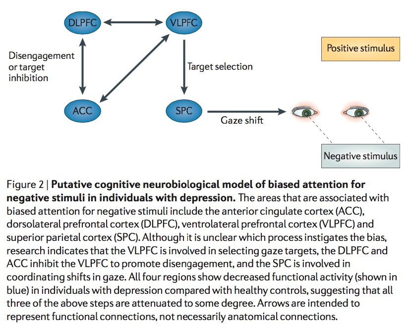
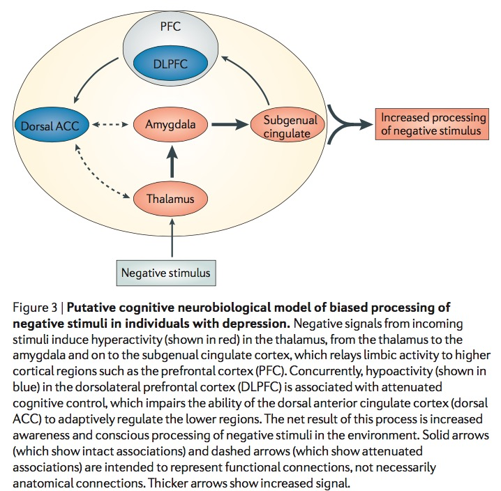
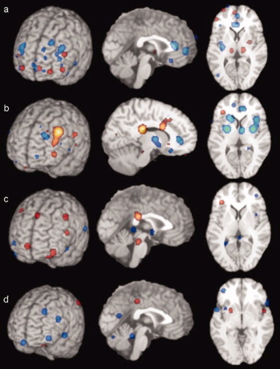
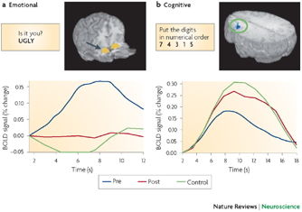
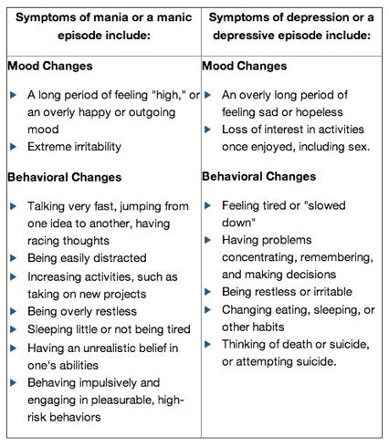
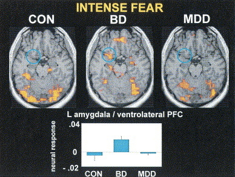
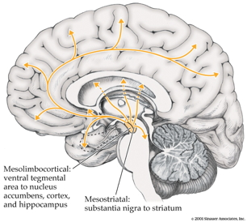

## Prelude

<iframe width="420" height="315" src="https://www.youtube.com/embed/EzoazPPC7b8" frameborder="0" allowfullscreen></iframe>

## Prelude

<iframe width="420" height="315" src="https://www.youtube.com/embed/-2GmzyeeXnQ" frameborder="0" allowfullscreen></iframe>

## Today's Topics

- Disorder and disease
    + Affective disorders
    + Schizophrenia
    + Parkinson's
    + Huntington's
    
## Framework

- Symptoms
- Genetic risk
- Neurological factors
- Neurochemical factors

## The face of depression

<iframe width="420" height="315" src="https://www.youtube.com/embed/OTZvnAF7UsA" frameborder="0" allowfullscreen></iframe>

## Major affective (emotional) disorders

- Types
    + Bipolar disorder
    + Depression
    + Anxiety
    
## Major affective (emotional) disorders
   
- Heritability
    + *proportion of variance in trait accounted for by genetic factors*
    + Monozygotic: .69
    + Dizygotic: .13
    
## Depression

- Symptoms
    + Insomnia, lethargy, loss of pleasure, interest, energy
- Agitation
- Lasting for several weeks or more
- Prevalence (~10% lifetime)
- Females 2-3x males

## Cognitive model

> ...negative cognitive biases in depression are facilitated by increased influence from subcortical emotion processing regions combined with attenuated top-down cognitive control.

[[@disner_neural_2011]](http://dx.doi.org/10.1038/nrn3027)

## [[@disner_neural_2011]](http://dx.doi.org/10.1038/nrn3027)

## [[@disner_neural_2011]](http://dx.doi.org/10.1038/nrn3027)

## [[@disner_neural_2011]](http://dx.doi.org/10.1038/nrn3027)

## [[@disner_neural_2011]](http://dx.doi.org/10.1038/nrn3027)

## Neurological factors

- Reduced hippocampal volumes
- [[@videbech2004hippocampal]](http://dx.doi.org/10.1176/appi.ajp.161.11.1957) meta-analysis

## [[@videbech2004hippocampal]](http://dx.doi.org/10.1176/appi.ajp.161.11.1957)

## [[@videbech2004hippocampal]](http://dx.doi.org/10.1176/appi.ajp.161.11.1957)

## Neurological factors

- Hypoactivity in
    + Frontal and temporal cortex
    + Anterior cingulate
    + Insula
    + Cerebellum
- [[@fitzgerald_meta-analytic_2008]](http://dx.doi.org/10.1002/hbm.20426)

## [[@fitzgerald_meta-analytic_2008]](http://dx.doi.org/10.1002/hbm.20426) {.smaller}

(a) patients v. controls, (b) patients on SSRIs, (c) patients v. ctrls (happy stim), (d) patients v. controls (sad stim)

## Neurological Factors

- Persistent activation in amygdala
- Amygdala and dorsolateral prefrontal cortex (DLPFC) inversely related
- [[@siegle_cant_2002]](http://dx.doi.org/10.1016/S0006-3223(02)01314-8)

## [[@siegle_cant_2002]](http://dx.doi.org/10.1016/S0006-3223(02)01314-8)

## [[@siegle_cant_2002]](http://dx.doi.org/10.1016/S0006-3223(02)01314-8)

## Disturbed sleep

- Less slow wave (stage 3 and 4) 
- More REM earlier in night (typical is longer REM as night goes on)

## Pharmacological factors

- Lowered thyroid function
- High/chronic cortisol levels 
- Monoamine hypothesis, [@schildkraut_catecholamine_1965]
    + More: euphoria
    + Less: depression
    + Resperine (antagonist for NE & 5-HT) can cause depression

## Pharmacological factors

- Serotonin hypothese, [@coppen_biochemistry_1967].
    + Low serotonin (5-HT) metabolite levels in CSF of suicidal depressives [[@samuelsson_csf_2006]](http://dx.doi.org/10.1111/j.1600-0447.2005.00639.x)
    
## [[@samuelsson_csf_2006]](http://dx.doi.org/10.1111/j.1600-0447.2005.00639.x)

## Revisiting the serotonin hypothesis

- *The neurobiology of depression—revisiting the serotonin hypothesis. I. Cellular and molecular mechanisms*, <http://rstb.royalsocietypublishing.org/content/367/1601.toc>
- *The neurobiology of depression—revisiting the serotonin hypothesis. II. Genetic, epigenetic and clinical studies*, <http://rstb.royalsocietypublishing.org/content/368/1615>

## Treatments for depression

- Psychotherapy
    + Often effective when combined with drug treatment
- Drugs
- Exercise
- Electroconvulsive Shock (ECT)

## "First generation" drugs

- Monoamine oxidase (MAO) inhibitors
    + MAO destroys excess monoamines in terminal buttons
    + MAO-I’s boost monoamine levels
    + side effects may include "[serotonin syndrome](https://www.nlm.nih.gov/medlineplus/ency/article/007272.htm)"
    
## "First generation" drugs

- Tricyclics
    + Inhibit NE, 5-HT reuptake
    + Upregulate monoamine levels
    + but non-selective = side effects, esp. blood pressure/heart rate

## "Second and third generation" drugs

- Selective Serotonin Reuptake Inhibitors (SSRIs)
    + Block action of 5-HT transporter (SERT)
    + Fluoxetine (Prozac, Paxil, Zoloft)
    + Prolong duration 5-HT in synaptic cleft
    + Also increase brain steroid production
    
## Others

- Serotonin-Norepinephrine Reuptake Inhibitors (SNRIs)
    + e.g., Cymbalta, Effexor
- Norepinephrine reuptake inhibitors (NRI, NERI) or adrenergic reuptake inhibitors (ARI)
- Norepinephrine-Dopamine Reuptake Inhbitors (NDRIs)
    + e.g., Wellbutrin

## Problems with monoamine hypothesis

- Too simplistic
- NE, 5-HT interact
- Drugs fast acting (min), but improvement slow (weeks)

## What do drugs do, then?

- Receptor sensitivity altered?
    + Presynaptic serotonin autoreceptors compensate
    + Postsynaptic upregulation of NE/5-HT effects
    + Link to neurotrophin BDNF
    + BDNF boosts neurogenesis

## Exercise as a treatment

[[@babyak2000exercise]](http://journals.lww.com/psychosomaticmedicine/Abstract/2000/09000/Exercise_Treatment_for_Major_Depression_.6.aspx)

## Drugs vs. therapy

[[@derubeis_cognitive_2008]](http://dx.doi.org/10.1038/nrn2345)

## [[@derubeis_cognitive_2008]](http://dx.doi.org/10.1038/nrn2345)

## [[@derubeis_cognitive_2008]](http://dx.doi.org/10.1038/nrn2345)

## [[@derubeis_cognitive_2008]](http://dx.doi.org/10.1038/nrn2345)

## Depression's widespread impact

- Widespread brain dysfunction
- Prefrontal cortex, amygdala, HPA axis, circadian rhythms
- Genetic + environmental factors
- Disturbance in 5-HT, NE systems, cortisol

## Bipolar disorder

## The face of bipolar disorder

<iframe width="420" height="315" src="https://www.youtube.com/embed/GbIFLT9r9g8" frameborder="0" allowfullscreen></iframe>

## Bipolar disorder

- Formerly “manic depression” or “manic depressive disorder
- Alternating mood states
    + Mania or hypomania (milder form)
    + Depression
- Cycles 3-6 mos in length, but
    + Rapid cycling (weeks or days)
- Suicide risk 20-60x normal population, [[@baldessarini_suicide_2006]](http://dx.doi.org/10.1017/S1092852900014681) 

## Symptoms

<http://www.nimh.nih.gov/health/topics/bipolar-disorder/index.shtml>

## Prevalence, subtypes

- 1-3% prevalence
- Subtypes
    + Bipolar I: manic episodes, possible depressive ones
    + Bipolar II: no manic episodes but hypomania + depression

## Genetics

- Overlap between bipolar disorder and schizophrenia
- Genes for voltage-gated Ca++ channels
    + Regulate NT, hormone release
    + Gene expression, cell metabolism
- [[@craddock_genetics_2013]](http://dx.doi.org/10.1016/S0140-6736(13)60855-7)

## Brain responses to emotional faces ≠ depression

[[@lawrence_subcortical_2004]](http://dx.doi.org/10.1016/j.biopsych.2003.11.017)

## [[@lawrence_subcortical_2004]](http://dx.doi.org/10.1016/j.biopsych.2003.11.017)

## [[@lawrence_subcortical_2004]](http://dx.doi.org/10.1016/j.biopsych.2003.11.017)

## Amyg, Hip volume reduced, 

[[@hallahan_structural_2011]](http://dx.doi.org/10.1016/j.biopsych.2010.08.029)

## [[@hallahan_structural_2011]](http://dx.doi.org/10.1016/j.biopsych.2010.08.029)

## Drug treatments

- Mood stabilizers
    + Lithium (Li)
    + Valproate 
- Anticonvulsants
    + GABA agonists
    + Usually to treat epilepsy
    + e.g. lamotrigine (Lamictal)
- Antipsychotics

## Effects of Lithium

- Reduces mania, minimal effects on depressive states
- Increases/preserves PFC, hip, amyg volume
- downregulates DA, glu; upregulates GABA
- modulates 5-HT, NE
- [[@malhi_potential_2013]](http://dx.doi.org/10.1007/s40263-013-0039-0)

## What does lithium do?

> At a neuronal level, lithium reduces excitatory (dopamine and glutamate) but increases inhibitory (GABA) neurotransmission; however, these broad effects are underpinned by complex neurotransmitter systems that strive to achieve homeostasis by way of compensatory changes. For example, at an intracellular and molecular level, lithium targets second-messenger systems that further modulate neurotransmission... 

[[@malhi_potential_2013]](http://dx.doi.org/10.1007/s40263-013-0039-0)

## An Unquiet Mind

## BP summed-up

- Changes in mood, but ≠ depression
- Genetic + environmental risk
- Changes in emotion processing network activity, size of hippocampus
- But, heterogeneous
- No simple link to a specific NT system

## Interlude

<iframe width="560" height="315" src="https://www.youtube.com/embed/lioWzrpCtGQ" frameborder="0" allowfullscreen></iframe>

## Interlude

<iframe width="420" height="315" src="https://www.youtube.com/embed/L0CVoFsUhC4" frameborder="0" allowfullscreen></iframe>

## Interlude

<iframe width="420" height="315" src="https://www.youtube.com/embed/XaI5IRuS2aE" frameborder="0" allowfullscreen></iframe>

## Schizophrenia

## The face of schizophrenia

<iframe width="420" height="315" src="https://www.youtube.com/embed/gGnl8dqEoPQ" frameborder="0" allowfullscreen></iframe>

## Overview

- Lifetime prevalence ~ 1/100
- 1/3 chronic & severe
- Onset post-puberty, early adulthood
- Pervasive disturbance in mood, thinking, movement, action, memory, perception

## Screening (Yale PRIME test)

1. I think that I have felt that there are odd or unusual things going on that I can’t explain.
2. I think that I might be able to predict the future.
3. I may have felt that there could possibly be something interrupting or controlling my thoughts, feelings, or actions. 

<http://www.schizophrenia.com/sztest/primetest.pdf>

## Screening (continued)

5. I get confused at times whether something I experience or perceive may be real or may be just part of my imagination or dreams. 
6. I have thought that it might be possible that other people can read my mind, or that I can read other’s minds.
7. I wonder if people may be planning to hurt me or even may be about to hurt me.

## Historical background

- Bleuler
    + Introduced “schizophrenia” or “split mind”
    + **Not** multiple personality disorder
- Kraeplin
    + Dementia Praecox and Paraphrenia (1919)
    + Emphasized developmental and hereditary origins

## "Positive" symptoms

- “Additions” to behavior
- Disordered thought
- Delusions of grandeur, persecution
- Hallucinations (usually auditory)
- Bizarre behavior

## "Negative" symptoms

- “Reductions” in behavior
- Poverty of speech
- Flat affect
- Social withdrawal
- Impaired executive function
- Anhedonia (loss of pleasure)
- Catatonia (reduced movement)

## Biological bases

- Genetic disposition
- Brain abnormalities
- Developmental origins

## Genetic disposition

## Ventricles larger, esp in males

## Hip and amyg smaller

- Related to ventricular enlargement?
- Early disturbance in brain development?

## Rapid gray matter loss in adolescents?

[[@thompson_mapping_2001]](http://dx.doi.org/10.1073/pnas.201243998)

## Dopamine hypothesis

## Evidence for DA hypothesis

- DA (D2 receptor) antagonists (e.g. chlorpromazine)
    + improve positive symptoms
- DA agonists
    + amphetamine, cocaine, L-DOPA
    + mimic or exacerbate symptoms

## Evidence against...

- New drugs 
    + (e.g. Clozapine) INCREASE DA in frontal cortex, effect 5-HT
- Mixed evidence for high DA metabolite levels in CSF
- Glutamate hypothesis
    + Underactivation of NMDA receptors?
    + NMDA receptor role in learning, plasticity

## Schizophrenia summed up

- Wide-ranging disturbance of mood, thought, action, perception
- Broad changes in brain structure, function, chemistry
- Genetic risk + environmental factors

## Neurodegenerative disorders

- Parkinson's
- Huntington's
- Alzheimer's

## Parkinson's

Maurice White, Musician

## The Faces of Parkinson's

<iframe width="560" height="315" src="https://www.youtube.com/embed/CqEwPqUO1Bw" frameborder="0" allowfullscreen></iframe>

## Parkinson's

- Slow, absent movement, resting tremor
- Cognitive deficits, depression
- DA Neurons in substantia nigra degenerate
- Treatments
    + DA agonists
    + [Deep brain stimulation](http://www.ninds.nih.gov/disorders/deep_brain_stimulation/deep_brain_stimulation.htm)
    + [Stem cells?](http://www.eurostemcell.org/factsheet/parkinson’s-disease-how-could-stem-cells-help)
    
## Huntington's

<http://cp91279.biography.com/1000509261001/1000509261001_1733824754001_woody-guthrie-centennial-1.jpg>

## The face of Huntington's

<iframe width="560" height="315" src="https://www.youtube.com/embed/HBLrY_nXU_U" frameborder="0" allowfullscreen></iframe>

## Huntington's

- Formerly Huntington’s Chorea
    + "Chorea" from Greek for "dance"
    + “Dance-like” pattern of involuntary movements
- Cognitive decline
- Genetic + environmental influences
- Disturbance in striatum
- No effective treatment

## Next time...

- Exams due at midnight on Monday, 11/16.
- Audition

## Postlude

<iframe width="420" height="315" src="https://www.youtube.com/embed/It7107ELQvY" frameborder="0" allowfullscreen></iframe>

## References {.smaller}
