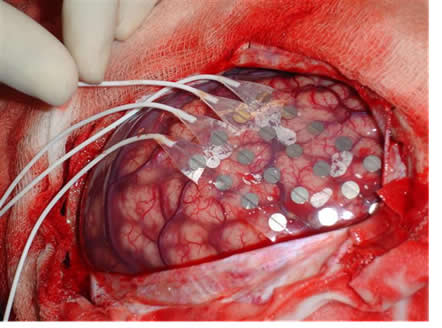

## Prelude

<iframe width="560" height="315" src="https://www.youtube.com/embed/JB7jSFeVz1U" frameborder="0" allowfullscreen></iframe>

## PSY 511 {.flexbox .vcenter}

### Foundations of Cognitive and Affective Neuroscience

#### Rick O. Gilmore, Ph.D. 
Associate Professor of Psychology

## Why neuroscience is harder than physics {.flexbox .vcenter}

## Why neuroscience is harder than physics {.flexbox .vcenter}

## What do we need to know to answer the question?

### A. What is the wedge made of?
### B. What happened to the mouse recently? 
### C. The mouse’s sex or age?
### D. The mouse’s state (hungry, horny, asleep)
### E. Mouse’s genetic strain

## This course is about...

## Genes {.flexbox .vcenter}

<http://ecx.images-amazon.com/images/I/41OzMnt3lpL._SX319_BO1,204,203,200_.jpg>

## Neurotransmitters {.flexbox .vcenter}

<http://rlv.zcache.com/blame_my_neurotransmitters_if_not_paying_attention_mousepad-p144383961261005279trak_400.jpg>

## Neurons {.flexbox .vcenter}

<http://www.biolegend.com/NewsLegend/032515blog/neuron_cartoon.jpg>

## Networks

<https://s-media-cache-ak0.pinimg.com/236x/a9/94/3a/a9943ae81a965e483227b6f9f5e7ca5f.jpg>

## Brains {.flexbox .vcenter}

<http://unearthedcomics.com/wp-content/uploads/2012/12/Unearthed-BrainWandering-1211-2-web.jpg>

## Behavior {.flexbox .vcenter}

<http://www.glasbergen.com/wp-content/gallery/teen/edu01.gif>

----

<http://nyti.ms/2bfmN9F>

----

<http://nyti.ms/2byeiEJ>

## Goals

- Master fundamentals of neuroscientific concepts and facts
- Prepare to read primary source literature in behavioral, cognitive, affective, and clinical neuroscience

## Course structure

<https://github.com/psu-psychology/psy-511-scan-fdns>

## What is the basic plan of the nervous system?

- Neuroanatomy
- Rooted in behavior, evolution, development

## Approach

- How do neurons and networks achieve behavioral goals?
- Information processing or computing

## Approach

### What do animals (and people) do?

- Have to
- Choose to

### What’s the information required?

- Input 
- Computation/processing
- Output

## Approach

### Brain architecture (neuroanatomy)
### Brain function (neurophysiology)
### Brain communication (neurochemistry)
### Changes over evolutionary and developmental time
  
## What is neuroscience?

### The study of the nervous system
- And the behavior it makes possible

### Questions

- What are the parts of the nervous system?
- How do the parts work?  What do they do?
- Where did they come from?
  
## Your turn

- What are the main categories of behavior we want to understand?
- [Papers you want to read](https://github.com/psu-psychology/psy-511-scan-fdns/blob/master/handouts/papers-we-want-2-understand.md)

## Your turn, Part II

- How do the behaviors you picked fit with the prior framework?

- Describe the main
    + Inputs
    + Outputs
    + Computations

## Biological imperatives

### Sustenance

- Eating & drinking

### Protection

- Act or rest
- Fight, flee, hide, freeze

### Reproduction

- Mate seeking
- Territory protection, nest-building 
- Mating
- Caregiving

## Brain architecture for enacting biological imperatives {.flexbox .vcenter}

## Neuroscience methods

- Methods to the madness
- Tools in the neuroscientist’s toolkit
- What they tell us, and what they don’t

## Evaluating methods 

### What is the question?

### What are we measuring?

- Structure
- Activity

### Strengths & Weaknesses

- Cost
- Invasiveness
- Spatial/temporal resolution

## Spatial resolution {.flexbox .vcenter}

<http://ai.ato.ms/MITECS/Images/churchland.figure1.gif>

## Types of methods

### Structural

- Mapping the circuitry
- Anatomy

### Functional

- What does it do?
- Physiology/Activity

## Mapping structures

- Cell/axon stains
    + Golgi stain -- whole cells
        - [Camillo Golgi](https://en.wikipedia.org/wiki/Camillo_Golgi)
    + Nissl stain -- cell bodies only
        - [Franz Nissl](https://en.wikipedia.org/wiki/Franz_Nissl)
    + Cellular distribution, concentration, microanatomy

## Golgi stain

## Nissl stain

## Retrograde vs. anterograde [histochemical tracers](https://en.wikipedia.org/wiki/Histochemical_tracer)

- *Retrograde* (from axon terminal to cell body); *anterograde* (from cell body to axon terminal)
- What connects where

## Retrograde vs. anterograde tracers

----

<iframe width="560" height="315" src="https://www.youtube.com/embed/5Lc64j-Rsy4" frameborder="0" allowfullscreen></iframe>

## [Brainbow](http://cbs.fas.harvard.edu/science/connectome-project/brainbow)

[[@lichtman_technicolour_2008]](http://doi.org/10.1038/nrn2391)

## Brainbow

[[@lichtman_technicolour_2008]](http://doi.org/10.1038/nrn2391)

## [Eyewire.org](http://eyewire.org)

<iframe width="560" height="315" src="https://www.youtube.com/embed/c43jVfpzvZ0" frameborder="0" allowfullscreen></iframe>

## [Clarity](http://clarityresourcecenter.com/CLARITY.html)

<iframe width="560" height="315" src="https://www.youtube.com/embed/c-NMfp13Uug" frameborder="0" allowfullscreen></iframe>

## Mapping structures

- Computed axial tomography (CAT), CT
- X-ray based

<http://img.tfd.com/mk/T/X2604-T-22.png>

## Tomography {.flexbox .vcenter}

<http://static.howstuffworks.com/gif/cat-scan-pineapple.jpg>

## CT scan of stroke

## Magnetic Resonance Imaging

- Magnetic resonance
- Protons have spin (magnetic dipole)
- Align with strong magnetic field
- When perturbed, speed of realignment varies by tissue
- Realignment gives off radio frequency signals

## MRI {.flexbox .vcenter}

<http://s.hswstatic.com/gif/mri-steps.jpg>

----

<iframe width="560" height="315" src="https://www.youtube.com/embed/MiL0wCZr0Mw" frameborder="0" allowfullscreen></iframe>

## Structural MRI

- Tissue density/type differences
- Gray vs. white - Axon fibers
- Spectroscopy
- Region sizes/volumes

## Diffusion tensor imaging (DTI)

<https://www.simonsfoundation.org/wp-content/uploads/2012/02/hitting-nerve3.jpeg>

## Voxel-based morphometry (VBM)

<http://www.frontiersin.org/files/Articles/18691/fnhum-06-00184-HTML/image_m/fnhum-06-00184-g003.jpg>

## Functional methods

- Recording from the brain 
- Interfering with the brain 
- Stimulating the brain

## Recording from the brain

- Single/multi unit recording
- Microelectrodes
- Small numbers of nerve cells

## Single/multi-unit Recording {.flexbox .vcenter}

<http://www.nature.com/nrn/journal/v5/n11/images/nrn1535-i1.jpg>

## Single/multi-unit recording

- What does neuron X respond to?
- Great temporal (ms), spatial resolution (um)
- Invasive
- Rarely suitable for humans, but...

## Electrocorticography {.flexbox .vcenter}

<http://www.neurofisiologia.net/wp-content/uploads/2009/07/corticografia.jpg>

## Single-cell studies ask...

- How does firing frequency, timing vary with behavior?

## Positron Emission Tomography (PET)

- Radioactive tracers (glucose, oxygen)
- Positron decay
- Experimental condition - control
- Average across individuals

----

## More on PET

- Temporal (~ s) and spatial (mm-cm) resolution worse than fMRI
- Radioactive exposures + mildly invasive 
- Dose < airline crew exposure in 1 yr

## Functional Magnetic Resonance Imaging (fMRI)

- Neural activity -> local O2 consumption increase
- Blood Oxygen Level Dependent (BOLD) response
- Oxygenated vs. deoxygenated hemoglobin
- Do regional blood O2 levels (and flow) vary with behavior X?
- Non-invasive, but expensive
- Moderate but improving (mm) spatial, temporal (~sec) resolution
- Hemodynamic Response Function
- 1s delay plus 3-6 s ramp-up

## Hemodynamic Response Function (HRF)

<http://openi.nlm.nih.gov/imgs/512/236/3109590/3109590_TONIJ-5-24_F1.png>

## Main points

- Multiple structural, functional methods
- Different levels of spatial/temporal resolution

## Next time

- More on neuroscience methods