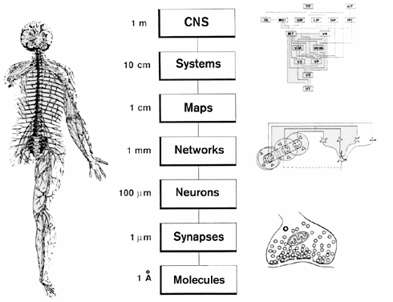
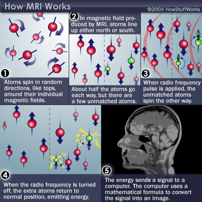
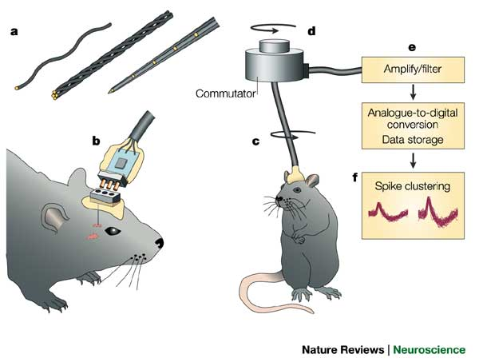
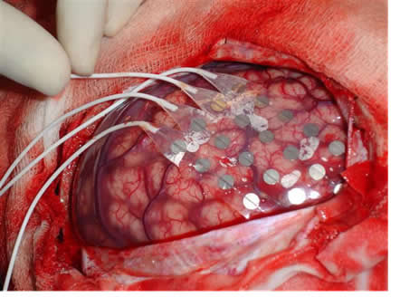
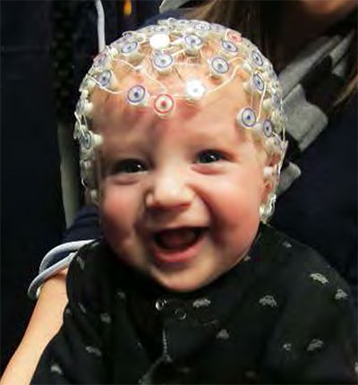
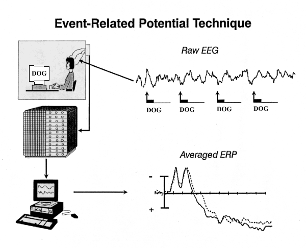
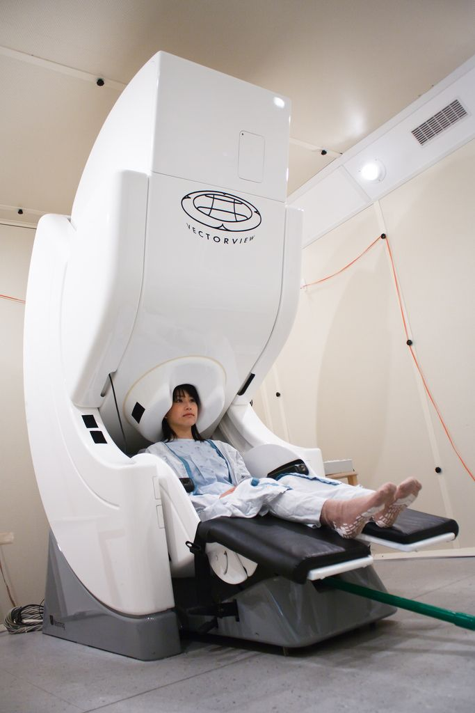
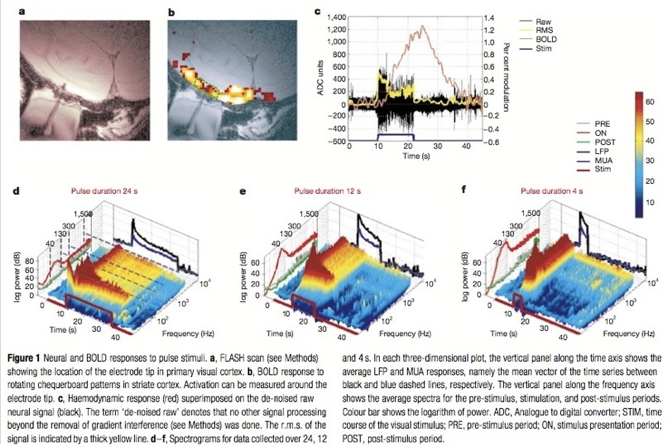
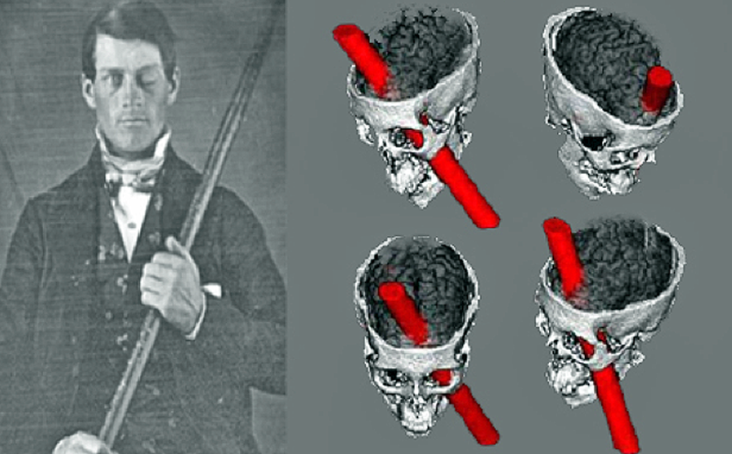
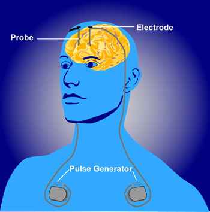

## Prelude

<iframe width="420" height="315" src="https://www.youtube.com/embed/0fKBhvDjuy0" frameborder="0" allowfullscreen></iframe>

Classic "Powers of Ten" movie by Charles and Ray Eames (10 min).

## Today's topics

- Methods to the madness

## Spatial resolution {.flexbox .vcenter}

## Magnetic Resonance Imaging

- Magnetic resonance
- Protons have spin (magnetic dipole)
- Align with strong magnetic field
- When perturbed, speed of realignment varies by tissue
- Realignment gives off radio frequency signals

## MRI {.flexbox .vcenter}

<http://s.hswstatic.com/gif/mri-steps.jpg>

----

<iframe width="560" height="315" src="https://www.youtube.com/embed/MiL0wCZr0Mw" frameborder="0" allowfullscreen></iframe>

## Structural MRI

- Tissue density/type differences
- Gray vs. white - Axon fibers
- Spectroscopy
- Region sizes/volumes

## Diffusion tensor imaging (DTI)

<https://www.simonsfoundation.org/wp-content/uploads/2012/02/hitting-nerve3.jpeg>

## Voxel-based morphometry (VBM)

<http://www.frontiersin.org/files/Articles/18691/fnhum-06-00184-HTML/image_m/fnhum-06-00184-g003.jpg>

## Functional methods

- Recording from the brain 
- Interfering with the brain 
- Stimulating the brain

## Recording from the brain

- Single/multi unit recording
- Microelectrodes
- Small numbers of nerve cells

## Single/multi-unit Recording {.flexbox .vcenter}

<http://www.nature.com/nrn/journal/v5/n11/images/nrn1535-i1.jpg>

## Single/multi-unit recording

- What does neuron X respond to?
- Great temporal (ms), spatial resolution (um)
- Invasive
- Rarely suitable for humans, but...

## Electrocorticography {.flexbox .vcenter}

<http://www.neurofisiologia.net/wp-content/uploads/2009/07/corticografia.jpg>

----

<iframe width="560" height="315" src="https://www.youtube.com/embed/HluVToAamXY" frameborder="0" allowfullscreen></iframe>

Story about child who underwent ECoG surgery.

## Single-cell studies ask...

- How does firing frequency, timing vary with behavior?

----

<iframe width="560" height="315" src="https://www.youtube.com/embed/IOHayh06LJ4" frameborder="0" allowfullscreen></iframe>

Short video of discovery by Hubel & Wiesel of orientation selective cells in cat V1.

## Positron Emission Tomography (PET)

- Radioactive tracers (glucose, oxygen)
- Positron decay
- Experimental condition - control
- Average across individuals

----

## More on PET

- Temporal (~ s) and spatial (mm-cm) resolution worse than fMRI
- Radioactive exposures + mildly invasive 
- Dose < airline crew exposure in 1 yr

## Functional Magnetic Resonance Imaging (fMRI)

- Neural activity -> local O2 consumption increase
- Blood Oxygen Level Dependent (BOLD) response
- Oxygenated vs. deoxygenated hemoglobin
- Do regional blood O2 levels (and flow) vary with behavior X?
- Non-invasive, but expensive
- Moderate but improving (mm) spatial, temporal (~sec) resolution
- Hemodynamic Response Function
- 1s delay plus 3-6 s ramp-up

## Hemodynamic Response Function (HRF)

<http://openi.nlm.nih.gov/imgs/512/236/3109590/3109590_TONIJ-5-24_F1.png>

## Electroencephalography (EEG)

- How does it work?
- Electrodes on scalp or brain surface
- What do we measure?
- Combined activity of huge # of neurons

## Collecting EEG {.flexbox .vcenter}

<http://sfari.org/images/images-2013-folder/images-sfn-2013/20131110sfneeg>

## EEG

- High temporal, poor spatial resolution
- Analyze frequency bands
  + LOW: deep sleep
  + MIDDLE: Quiet, alert state
  + HIGH:“Binding” information across senses
  
## EEG Frequency {.flexbox .vcenter}

<http://www.peakmind.co.uk/images/frequency.jpg>

## Event-related potentials (ERPs)

- EEGs time-locked to some event - Averaged over many trials

## ERP {.flexbox .vcenter}

<http://2.bp.blogspot.com/_2ob-1_LsjJs/TAUjw9i_dYI/AAAAAAAAAQQ/9AfiHsnD-P8/s1600/ERP_technique.gif>

## Magneto-encephalography (MEG)

- Like EEG, but measuring magnetic fields
- High temporal resolution
- Magnetic field propagates w/o distortion

## MEG {.flexbox .vcenter}

<http://www.massgeneral.org/psychiatry/assets/images/Magnetoencephalography_MEG_MGH.jpg>

## How do EEG and fMRI relate? {.flexbox .vcenter}

## Manipulating the brain

- Interfering with it 
- Stimulating it

## Interfering with the brain

- Nature’s“experiments” 
- Stroke, head injury, tumor
- Neuropsychology

## Phineas Gage {.flexbox .vcenter}

<http://onlinestorybank.com/wp-content/uploads/2014/03/Phineas-Gage.png>

## Evaluating neuropsychological methods

- Logic: damage impairs performance = region critical for behavior
- Poor spatial/temporal resolution, limited control

##Stimulating the brain

- Electrical (Direct Current Stimulation - DCS)
- Pharmacological
- Magnetic (Transcranial magnetic stimulation-TMS)

## Stimulating the brain

- Spatial/temporal resolution?
- Assume stimulation mimics natural activity?

## Deep brain stimulation as therapy

- Parkinson’s Disease 
- Depression 
- Epilepsy

## {.flexbox .vcenter}

<http://www.nimh.nih.gov/images/health-and-outreach/mental-health-topic-brain-stimulation-therapies/dbs_60715_3.jpg>

which 

## *SIM*ulating the brain

- Computer/mathematical models of brain function
- Example: neural networks
- Cheap, noninvasive, can be stimulated or “lesioned”

----

Image of a "deep learning" convolutional neural network.

## Main points

- Multiple structural, functional methods
- Different levels of spatial/temporal resolution

## Next time

- More on neuroscience methods

## References

