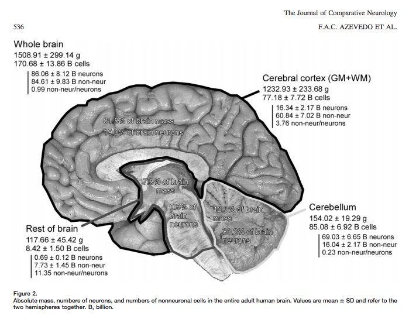

## Announcements

- **Quiz 1** Wednesday
    + 10 questions/10 points
    + Gross anatomy, levels of analysis, methods, history

## Today's Topics

- Cells of the nervous system
    + Glia
    + Neurons

## Visualizing the microanatomy of the brain

<iframe width="560" height="315" src="https://www.youtube.com/embed/nvXuq9jRWKE" frameborder="0" allowfullscreen></iframe>

## Crowd-sourcing anatomy research with [EyeWire](http://eyewire.org)

<iframe width="560" height="315" src="https://www.youtube.com/embed/zMmjGExpDP8" frameborder="0" allowfullscreen></iframe>

## How many neurons and glia?

- Old "lore": ~100 billion neurons
- New estimate [@azevedo2009equal]:
    + ~86 +/- 8 billion neurons
    + 85 +/- 9 billion glia

## How many neurons and glia? {.bigger}

*"These findings challenge the common view that humans stand out from other primates in their brain composition and indicate that, with regard to numbers of neuronal and nonneuronal cells, the human brain is an isometrically scaled-up primate brain."*

[[@azevedo2009equal]](http://doi.org/10.1002/cne.21974)
    
## Mass, Neurons, Non-Neurons

[[@azevedo2009equal]](http://doi.org/10.1002/cne.21974)

## Could you count to 170 billion? {.bigger}

- How many years to count to 170 billion?
- 60 s/min * 60 min/hr * 24 hrs/day * 365 days/ yr = 31,536,000 s/yr
- 1e11/31,536,000 = 5,390 years

## Glia (neuroglia) {.bigger}

- Functions
	+ Structural support
	+ Metabolic support
	+ Brain development

## Astrocytes {.bigger}

- "Star-shaped"
- Most numerous cell type
- Physical and metabolic support
	+ Blood/brain barrier
	+ Ion (Ca++/K+) buffering
	+ Neurotransmitter (e.g., glutamate) buffering
	+ Shape early brain development
	+ Regulate local blood flow
	
## Astrocytes

<https://upload.wikimedia.org/wikipedia/commons/5/56/Human_astrocyte.png>

## Myelinating cells {.bigger}

- Oligodendrocytes
	+ In brain and spinal cord (CNS)
	+ 1:many neurons
- Schwann cells
	+ In PNS
	+ 1:1 neuron
	+ Facilitate neuro-regeneration
	
## Oligodendrocytes

<https://upload.wikimedia.org/wikipedia/commons/thumb/8/8a/Oligodendendrocytes_in_rat_brain.tif/lossy-page1-800px-Oligodendendrocytes_in_rat_brain.tif.jpg>

## Schwann Cells {.smaller}

<http://www.sciencellonline.com/media/catalog/product/cache/1/image/a6f8fb4f61eb724cff40f184d1fbcab0/m/1/m1700_3.jpg>

## Microglia {.bigger}

- Phagocytosis
- Clean-up damaged, dead tissue
- Role in 'pruning' of synapses in normal development

## Microglia

<http://www.bioscience.utah.edu/faculty/molecular-biology-faculty/vetter/vetterfig2011.jpg>

## What makes neurons "special"?

- Long-lived (most generated b/w 3-25 weeks GA)
- Extended branching (dendrites and axons)
- Electrically excitable
- Connect to small #s of other cells via synapses
- Release neurotransmitters

## Macrostructure of neurons {.bigger}

- Dendrites
- Soma
- Axons
- Terminal buttons (boutons)

## Structure of neurons {.smaller}

<https://upload.wikimedia.org/wikipedia/commons/thumb/a/a9/Complete_neuron_cell_diagram_en.svg/1280px-Complete_neuron_cell_diagram_en.svg.png>

## Dendrites {.bigger}

- Majority of input to neuron
- Passive vs. active
- Spines

## Dendrites {.smaller}

<http://i.livescience.com/images/i/000/058/588/original/brain-cell.jpg?1383065356>

## Dendritic Spines {.smaller}

<https://upload.wikimedia.org/wikipedia/commons/b/b1/Dendritic_spines.jpg>

## Soma (cell body) {.bigger}

- Varied shapes
- Nucleus
	+ Chromosomes
- Organelles
	+ Mitochonrdria
	+ Smooth and Rough Endoplasmic reticulum (ER)
	
## Soma {.smaller}

<https://upload.wikimedia.org/wikipedia/commons/thumb/a/a9/Complete_neuron_cell_diagram_en.svg/1280px-Complete_neuron_cell_diagram_en.svg.png>

## Axons {.bigger}

- Initial segment
- Nodes of Ranvier
- Terminals

## Axons {.smaller}

<http://droualb.faculty.mjc.edu/Course%20Materials/Physiology%20101/Chapter%20Notes/Fall%202007/figure_07_02_labeled.jpg>

## Synaptic bouton (terminal button) {.bigger}

- Synapse (~5-10K per neuron) 
- Pre and postsynaptic membranes
– Synaptic cleft
- Synaptic vesicles
    + Neurotransmitters
- Autoreceptors & transporters

## Synaptic bouton (terminal button) {.smaller}

<http://antranik.org/wp-content/uploads/2012/04/synapse.jpg>

## Classifying neurons {.bigger}

- Functional role
    + Input (sensory), output (motor/secretory), interneurons 
- Anatomy
    + Unipolar
    + Bipolar
    + Multipolar
    
## Branching types {.smaller}

<https://upload.wikimedia.org/wikipedia/commons/thumb/9/92/Neurons_uni_bi_multi_pseudouni.svg/2000px-Neurons_uni_bi_multi_pseudouni.svg.pngg>

## Classifying neurons {.bigger}

- By specific anatomy
    + Pyramidal cells
    + Stellate cells 
    + Purkinje cells 
    + Granule cells

## Neurons by type {.smaller}

<http://blogs.scientificamerican.com/brainwaves/files/2012/05/selection-glamor-FINAL-300x225.jpg>

## Next time

- Quiz 1
- Neurophysiology

## References