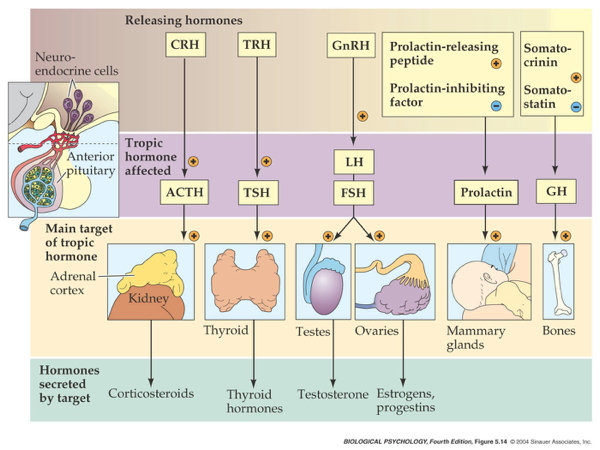

## Prelude

## Prelude

## Today's Topics

- Neurochemistry
    - How neurons talk to one another
- Neurotransmitters
- Hormones

----

Steps in synaptic transmission.

----

## How to stop your prey

| Substance | Effect |
|-----------|--------|
| Japanese pufferfish toxin | Blocks voltage-gated Na+ channels |
| Black widow spider venom | Accelerates presynaptic ACh release |
| Botulinum toxin | Prevents ACh vesicles from binding presynaptically |
| Sarin nerve gas | Impedes ACh breakdown by AChE |
| Pesticides | Impede AChE |
| Tetanus toxin | Blocks release of GABA, glycine |

## Monoamine Song {.smaller}

<iframe width="420" height="315" src="https://www.youtube.com/embed/gsjcb7w1Y-w" frameborder="0" allowfullscreen></iframe>

<https://en.wikipedia.org/wiki/Mah_Nà_Mah_Nà>

## Monoamine Song

Monoamines, do-do do do-do 
Monoamines, do do do-do 
Monoamines, do do do do-do do do-do do do-do do do do do-do do

## Monoamine Song

Monoamines, do-pa-mine is one 
Monoamines, norepi, too 
Monoamines, sero-tonin e-pinephrine, dop-a- mine, nor-epinephrine, melatonin, whoo!

## Monoamine Song

Monoamines, mod-u-late neurons  
Monoamines, throughout the brain 
Monoamines, keep people happy, brains snappy, not sleepy, not sappy, do-do do-do do-do do

## Monoamine NTs

| Family      | Neurotansmitter                         |
|-------------|-----------------------------------------|
| Monoamines  | Dopamine (DA)                           |
|             | Norepinephrine (NE)/Noradrenaline (NAd) |
|             | Epinephrine (Epi)/Adrenaline (Ad)       |
|             | Serotonin (5-HT)                        |
|             | Melatonin                               |
|             | Histamine                               |

## Information processing

- Point-to-point
    + One sender, small number of recipients
    + Glu, GABA
- Broadcast
    + One sender, widespread recipients
    + DA, NE, 5-HT, melatonin, histamine
- Need to know
    + NT, where projecting, type of receptor to predict function

## Dopamine

- Released by
    + Substantia nigra -> striatum, *meso-striatal projection*
    + Ventral tegmental area (VTA) -> nucleus accumbens, ventral striatum, hippocampus, amygdala, cortex; *meso-limbo-cortical projection*
    
## Dopamine Anatomy {.smaller}

<http://thebrain.mcgill.ca/flash/a/a_03/a_03_cl/a_03_cl_que/a_03_cl_que_1a.gif>

## DA Disruption linked to

- Parkinson's Disease (mesostriatal)
    + DA agonists treat (agonists facilitate/increase transmission)
- ADHD (mesolimbocortical)
- Schizophrenia (mesolimbocortical)
    + DA antagonists treat -- [Dopamine hypothesis of schizophrenia](https://en.wikipedia.org/wiki/Dopamine_hypothesis_of_schizophrenia)
- Addiction (mesolimbocortical) -- [reward system](https://en.wikipedia.org/wiki/Reward_system)

## DA Inactivated by {.smaller}

- Dopamine transporter (DAT) and chemical breakdown
    
<http://www.scholarpedia.org/article/Dopamine_anatomy#Dopamine_receptors>
    
## Dopamine receptors

| Type         | Receptor             | Comments                      |
|--------------|----------------------|-------------------------------|
| Metabotropic | D1-like (D1 and D5)  | more prevalent                |
|              | D2-like (D2, D3, D4) | target of many antipsychotics |

## Norepinephrine (NE)

- Released by 
    + *[locus coeruleus](http://www.scholarpedia.org/article/Locus_coeruleus)* in pons
    + postganglionic sympathetic neurons onto target tissues
- Role in arousal, mood, eating, sexual behavior
- Monoamine oxidase inhibitors (MAOIs)
    + inactivate monoamines in neurons, astrocytes
    + [MAOIs](https://en.wikipedia.org/wiki/Monoamine_oxidase_inhibitor) increase NE, DA
    + Treatment for depression
    
## NE Anatomy {.smaller}

<https://www.dartmouth.edu/~rswenson/NeuroSci/figures/Figure_9_files/image002.jpg>

## NE receptors

| Type         | Receptor             | Comments                           |
|--------------|----------------------|------------------------------------|
| Metabotropic | $\alpha$ (1,2)         | antagonists treat anxiety, panic   |
|              | $\beta$ (1,2,3)        | 'beta blockers' in cardiac disease |

## Serotonin (5-HT)

- Released by *raphe nuclei* in brainstem
- Role in mood, sleep, eating, pain, nausea, cognition, memory
- Modulates release of other NTs
- Most of body's 5-HT regulates digestion

## 5-HT anatomy {.smaller}

<https://www.dartmouth.edu/~rswenson/NeuroSci/figures/Figure_9_files/image002.jpg>

## 5-HT receptors

- Seven families (5-HT 1-7) with 14 types
- All but one metabotropic

## 5-HT clinical significance

- Ecstasy (MDMA) disturbs serotonin
- So does LSD
- Fluoxetine (Prozac)
    + *Selective Serotonin Reuptake Inhibitor (SSRI)*
    + Treats depression, panic, eating disorders, others
- 5-HT3 receptor antagonists are anti-mimetics used in treating nausea

## [Melatonin](https://en.wikipedia.org/wiki/Melatonin) {.smaller}

- Released by pineal gland

<http://www.vivo.colostate.edu/hbooks/pathphys/endocrine/otherendo/pinealgland.jpg>

## [Histamine](https://en.wikipedia.org/wiki/Histamine)

- Released by hypothalamus, projects to whole brain
- Metabotropic receptors
- Role in arousal/sleep regulation
- In body, part of immune response

## Targets of psychotropic drugs {.smaller}

<https://stahlonline.cambridge.org/essential_4th_chapter.jsf?page=chapter2_summary.htm&name=Chapter%202&title=Summary>

## Others

- Gases
    + *Nitric Oxide (NO)*, *carbon monoxide (CO)*
- Neuropeptides
    + *Substance P* and *endorphins* (endogenous morphine-like compounds) have role in pain
    + *Orexin/hypocretin*, project from lateral hypothalamus across brain, regulates appetite, arousal
    + *Cholecystokinin (CCK)* stimulates digestion
    
## Others

- Purines
    + *Adenosine* (inhibited by caffeine)
- Others
    + *Anandamide* (activates endogenous cannabinoid receptors)
    
## Types of chemical communication

- *Neurocrine*
    + Sending cell -> Receiving cell
- *Autocrine*
    + Sending cell -> itself
    + e.g., presynaptic autoreceptors
- *Paracrine*
    + Sending cell -> neighboring cells
    + NO and CO NTs
    
## Types of chemical communication

- *Endocrine*
    + Sending cell -> many cells elsewhere in body
- *Pheromone*
    + Sending cell -> other animals of same species
- *Allomone*
    + Sending cell -> cells in other species
    
## Hormones

- Chemical secreted into blood
- Act on specific target tissues
- Produce specific effects

## Can a substance be a hormone AND a neurotransmitter?

- Yes, why not?
- No, absolutely not.

## Can a substance be a hormone AND a neurotransmitter?

- **Yes, why not?**
- No, absolutely not.

- Examples
    + Melatonin
    + Epinephrine/adrenaline
    + Oxytocin
    + Vasopressin
    
## Behaviors under hormonal influence

## Behaviors under hormonal influence

- Ingestive (eating/ drinking)
    + Fluid levels
    + Na, K, Ca levels 
    + Digestion
    + Blood glucose levels
    
## Behaviors under hormonal influence

## Behaviors under hormonal influence

- Reproduction
    + Sexual Maturation
    + Mating
    + Birth
    + Care giving
    
## Behaviors under hormonal influence

## Behaviors under hormonal influence

- Responses to threat/ challenge
    + Metabolism
    + Heart rate, blood pressure 
    + Digestion
    + Arousal

## What do these behaviors have in common?

- Biological imperatives
- Proscribed in space and time
- Foraging/hunting
    + Find targets distributed in space, evaluate, act upon
- Often involve others

## Principles of hormonal action

- Gradual action
- Change intensity or probability of behavior 
- Behavior influences/influenced by hormones
    + +/- Feedback
- Multiple effects on different tissues

## Principles of hormonal action

- Produced in small amounts; released in bursts 
- Levels vary daily, seasonally
    + or are triggered by specific external/internal events
- Effect cellular metabolism 
- Influence only cells with receptors

## Differences between neural and hormonal communication

- Point to point vs.“broadcast”
    + Wider broadcast than neuromodulators
- Fast vs. slow-acting
- Short-acting vs. long-acting
- Digital (yes-no) vs. analog (graded) 
- Voluntary control vs. involuntary

## Similarities between neural and hormonal communication

- Chemical messengers stored for later release 
- Release follows stimulation
- Action depends on specific receptors
- 2nd messenger systems common

## Where are hormones released

## Where are hormones released?

- CNS
    + Hypothalamus
    + *Pituitary*
        * *Anterior*
        * *Posterior*
    + Pineal gland

## Where are hormones released

## Where are hormones released?

- Rest of body
    + *Thyroid*
    +  *Adrenal (ad=adjacent, renal=kidney) gland*
        * *Adrenal cortex*
        * *Adrenal medulla*
    + *Gonads* (testes/ovaries)

## Two release systems 

- Direct
- Indirect

## Direct hormone release into bloodstream

- Hypothalamus (paraventricular, supraoptic nucleus) to
- Posterior pituitary
    + *Oxytocin*
    + *Arginine Vasopressin (AVP, vasopressin)*
        
## Direct release {.smaller}

<https://upload.wikimedia.org/wikipedia/commons/thumb/7/70/1807_The_Posterior_Pituitary_Complex.jpg/594px-1807_The_Posterior_Pituitary_Complex.jpg>

## Indirect release

- Hypothalamus -> *releasing hormones* 
- Anterior pituitary -> *tropic hormones*
- End organs
    
## Indirect release

## Case studies

## Case 1: Responses to threat or challenge

- Neural response
    + *Sympathetic Adrenal Medulla (SAM) response*
    + Sympathetic NS activation of adrenal medulla, other organs
    + Releases NE and Epi
    
[[@ulrich-lai_neural_2009]](http://doi.org/10.1038/nrn2647)

----

## Case 1: Responses to threat or challenge

- Endocrine response
    + *Hypothalamic Pituitary Adrenal (HPA) axis*
    + Adrenal hormones released
- Hypothalamus
    + *Corticotropin Releasing Hormone (CRH)*
- Anterior pituitary
    + *Adrenocorticotropic hormone (ACTH)*
    
## Case 1: Responses to threat or challenge

- Adrenal cortex
    + *Glucocorticoids (e.g., cortisol)*
    + *Mineralocorticoids (e.g. aldosterone)*
    
----

## Adrenal hormones

- *Steroids*
    + Derived from cholesterol
- *Cortisol*
    + increases blood glucose, anti-inflammatory
    + negative consequences of prolonged exposure 
- *Aldosterone*
    + Regulates Na (and water) retention in kidneys
    
## Case 2: Reproductive behavior -- the milk letdown reflex

- Hypothalamus releases oxytocin into posterior pituitary
- Targets milk ducts in breast tissue

## Milk letdown reflex

## Oxytocin's role

- Sexual arousal
- Released in bursts during orgasm
- Stimulates uterine, vaginal contraction
- Links to social interaction, bonding  [[@Weisman2013158]](http://dx.doi.org/10.1016/j.biopsych.2013.05.026)
- Alters face processing in autism  [[@Domes2013164]](http://dx.doi.org/10.1016/j.biopsych.2013.02.007)

## Oxytocin

## Next time...

- How the human brain got this way...

## References {.smaller}
