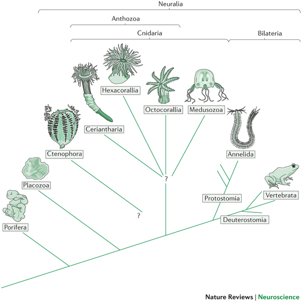
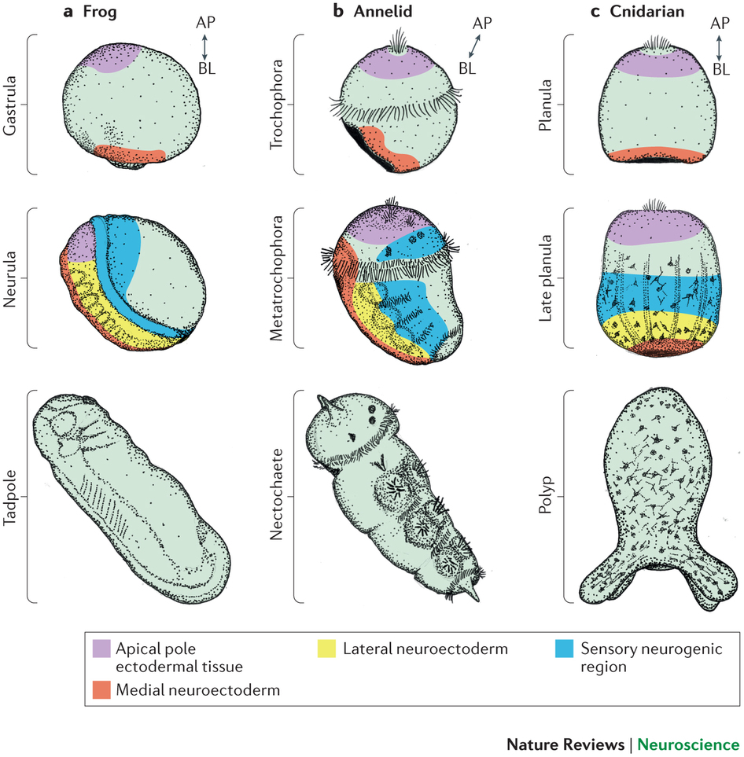

## Prelude

<iframe width="560" height="315" src="https://www.youtube.com/embed/hRyFjw9mwgg" frameborder="0" allowfullscreen></iframe>

## Prelude

<iframe width="420" height="315" src="https://www.youtube.com/embed/QMshTTIp7SA" frameborder="0" allowfullscreen></iframe>

## Today's Topics

- The evolution of the nervous system

## Public acceptance of evolution

[[@miller2006public]](http://dx.doi.org/10.1126/science.1126746)

## Types of evidence

- Fossil
    + Fossil dating
- Geological
    + Where fossils are found relative to one another
    + How long it takes to form layers
- Genetic
    + Rates of mutation
- Anatomical

## Dobzhansky

- "Nothing in Biology Makes Sense Except in the Light of Evolution"

[[@Dobzhansky1973]](http://dx.doi.org/10.2307/4444260)

## Dobzhansky

- "Seen in the light of evolution, biology is, perhaps, intellectually the most satisfying and inspiring science. Without that light, it becomes a pile of sundry facts some of them interesting or curious, but making no meaningful picture as a whole."
    
[[@Dobzhansky1973]](http://dx.doi.org/10.2307/4444260)

## Why Gilmore thinks it's controversial (in the U.S.)

- Contradicts verbatim/non-metaphorical reading of some religious texts
- Makes humans seem less special
- Time scales involved beyond human experience
- Scientific method vs. other ways of knowing
- Found in nature ≠ good for human society

## Why Gilmore thinks it's controversial (in the U.S.)

- Few negative consequences of 'disbelief'
- U.S. culture individualistic, skeptical, anti-elitist
- Lower levels of religious belief among [U.S. scientists](http://news.rice.edu/2015/12/03/first-worldwide-survey-of-religion-and-science-no-not-all-scientists-are-atheists/)
- [Politics](http://www.people-press.org/2009/07/09/section-4-scientists-politics-and-religion/)

## Ontogenesis and phylogenesis

- *Ontogenesis*
    + Development within lifetimes, history of individuals
- *Phylogenesis*
    + Change across lifestimes, history of species

## Ontogeny does not recapitulate phylogeny (Haeckel), but...

<https://upload.wikimedia.org/wikipedia/commons/thumb/0/08/Haeckel_drawings.jpg/350px-Haeckel_drawings.jpg>

## Complex multicellular life emerged "recently"

<http://www.zo.utexas.edu/faculty/sjasper/images/26.2.gif>

## Time scales {.smaller}

<http://www.indiana.edu/~geol105b/images/gaia_chapter_6/time_scale.gif>

## Evolution alters developmental programs

## Nervous system architectures

<http://sites.sinauer.com/animalphys3e/boxex/AnPhys3e-BoxEx-15-01-0.jpg>

## An animal with a nerve "net"

<iframe width="420" height="315" src="https://www.youtube.com/embed/-UI531GMRTM" frameborder="0" allowfullscreen></iframe>

## How nervous systems differ

- Body symmetry
    + radial
    + bilateral
- Segmentation
- Cephalization
- Encasement in bone (vertebrates)
- Centralized vs. distributed function

## Cephalopods have "intelligent arms"

<iframe width="700" height="400" src="http://www.sciencedirect.com/science/article/pii/S0022098113000683" frameborder="0" allowfullscreen></iframe>

## Biological imperatives

- Ingestion
- Defense
- Reproduction

## Information processing schematic

## Information processing universals

- Sense/detect
    + Sensors
- Analyze, evaluate, decide
- Act
    + Effectors
    + e.g., approach/avoid, manipulate, signal

## Sensors

- Specialize by information source/type
- Specialize by target location
    + Interoceptive
    + Exteroceptive
    
## Analysis, evaluation, decision

- Current state
    + World
    + Organism
- Current goals
- Past state(s)

## Effectors

- Move body
- Send signals
- Change physiological state

## From nerve net to nerve ring, nerve cord and brain — evolution of the nervous system [[@arendt_nerve_2016]](http://doi.org/10.1038/nrn.2015.15)

## [[@arendt_nerve_2016]](http://doi.org/10.1038/nrn.2015.15)

## [[@arendt_nerve_2016]](http://doi.org/10.1038/nrn.2015.15)

## Comparing brain sizes across vertebrates

## Brain sizes differ by vertebrate groups

## Evolutionary trends in cortical size

[@hofman_evolution_2014]

## Evolutionary trends in cortical size

| Structural measure | Non-human comparison | Human |
|--------------------|----------------------|-------|
| Cortical gray matter %/tot brain vol | insectivores 25% | 50% |
| Cortical gray + white | mice 40% | 80% |
| Cerebellar mass | primates, mammals 10-15% | 10-15% |

## Evolutionary trends in cortical size

[[@rakic2009evolution]](http://dx.doi.org/10.1038/nrn2719)

## Evolutionary trends in primate brain size

[[@hofman_evolution_2014]](http://journal.frontiersin.org/article/10.3389/fnana.2014.00015/full)

## Take homes

- Brain sizes scale with body size
- Brain sizes scale with animal class
- Within mammals, human brains bigger than expected
- Humans have larger cerebral cortical gray + white matter than comparable mammals.

## Next time...

- How ontogeny reflects phylogeny
- Brain development

## References {.smaller}
