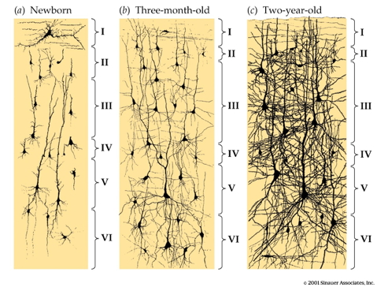
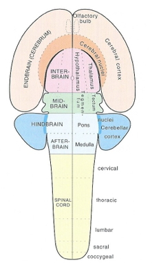

## Today's Topics

- Development of the nervous system

## Human brains have

- Significant "folding"
- Dense interconnections
- Large "association" areas

## How did the system get this way?

## Insemination

- 3-4 days before or up to 1-2 days after...
    + Ovulation

## Fertilization

- Within ~ 24 hrs of ovulation

## Implantation

- ~ 6 days after fertilization

## Early embryogenesis

<iframe width="560" height="315" src="https://www.youtube.com/embed/dAOWQC-OBv0" frameborder="0" allowfullscreen></iframe>

## Formation of neural tube (neurulation)

- Ectoderm, mesoderm, endoderm
- ~18-26 days
- Failures of neural tube closure
    + Spina bifida
    + Anencephaly
- Neural tube becomes
    + Ventricles
    + Central canal of spinal cord

## Neurogenesis and gliogenesis

- Stem cells along ventricles
- Symmetric cell division
- Asymmetric cell division

## Zika and microcephaly

<iframe src="http://www.cdc.gov/ncbddd/birthdefects/microcephaly.html">
</iframe>

## Radial glia

## Cell migration

## Radial unit hypothesis {.smaller}

[[@rakic2009evolution]](http://dx.doi.org/10.1038/nrn2719)

## Migration

<iframe width="420" height="315" src="https://www.youtube.com/embed/ZRF-gKZHINk" frameborder="0" allowfullscreen></iframe>

## Migration

<iframe width="420" height="315" src="https://www.youtube.com/embed/t-8bxeWqSV4" frameborder="0" allowfullscreen></iframe>

## Glial migration {.smaller}

<http://physrev.physiology.org/content/81/2/871>

## Axon growth cone

<iframe width="420" height="315" src="https://www.youtube.com/embed/Fgmt2RBow0I" frameborder="0" allowfullscreen></iframe>

## Axons follow

- Chemoattractants
    + e.g., Nerve Growth Factor (NGF)
- Chemorepellents
- Receptors in growth cone detect chemical gradients

## Differentiation

- Neuron vs. glial cell
- Cell type
- NTs released
- Where to connect

## Differential gene expression in PFC vs. other {.smaller}

[[johnson2009functional]](http://dx.doi.org/10.1016/j.neuron.2009.03.027)

## Synaptogenesis

## Postnatal patterns of synaptogenesis

## Proliferation, pruning

- Early proliferation
- Later pruning
- Rates, peaks differ by area

## Apoptosis

- Programmed cell death
- 20-80%, varies by area
- Spinal cord >> cortex
- Quantity of nerve growth factors (NGF) influences

## Apoptosis and cortical expansion

[[@rakic2009evolution]](http://dx.doi.org/10.1038/nrn2719)

## Synaptic rearrangement

## Synaptic rearrangement

- Progressive phase: growth rate >> loss rate
- Regressive phase: growth rate << loss rate

## Myelination

<http://d6igaq6njxgjh.cloudfront.net/content/physrev/81/2/871/F6.large.jpg>

## Myelination

- Neonatal brain largely unmyelinated
- Gradual myelination, peaks in mid-20s
- Non-uniform pattern
    - Spinal cord before brain
    - Sensory before motor

## Myelination across human development

[[@Hagmann02112010]](http://doi.org/10.1073/pnas.1009073107)

## Networks in the brain

[[@10.3389/fnhum.2014.00051]](http://doi.org/10.3389/fnhum.2014.00051)

## Myelination changes "network" properties

[[@Hagmann02112010]](http://doi.org/10.1073/pnas.1009073107)

## Synaptic rearrangment, myelination change cortical thickness

- [[@gogtay2004dynamic]](gogtay2004dynamic)
- Areal differences in cortical thickness change

## [[@gogtay2004dynamic]](gogtay2004dynamic)

<video width="320" height="240" controls>
  <source src="mov/02680Movie1.mp4" type="video/mp4">
Your browser does not support the video tag.
</video>

<video width="320" height="240" controls>
  <source src="mov/02680Movie2.mp4" type="video/mp4">
Your browser does not support the video tag.
</video>

<video width="320" height="240" controls>
  <source src="mov/02680Movie3.mp4" type="video/mp4">
Your browser does not support the video tag.
</video>

<video width="320" height="240" controls>
  <source src="mov/02680Movie4.mp4" type="video/mp4">
Your browser does not support the video tag.
</video>

## Human brain development take homes

- Prenatal
    + Neuro- and gliogenesis
    + Migration
    + Synaptogenesis begins
    + Differentiation
    + Apoptosis
    + Myelination begins
    + Infant gene expression ≠ Adult
    
## Human brain development take homes

- Postnatal
    + Synaptogenesis
    + Cortical expansion, activity-dependent change
    + Myelination
    + Prolonged period of postnatal/pre-reproductive development [[@konner_evolution_2011]](http://www.hup.harvard.edu/catalog.php?isbn=9780674062016)
    
## How brain development clarifies anatomical structure

## 3-4 weeks

## 4 weeks {.smaller}

<https://upload.wikimedia.org/wikipedia/commons/4/4c/4_week_embryo_brain.jpg>

## ~4 weeks

## 6 weeks {.smaller}

<https://upload.wikimedia.org/wikipedia/commons/thumb/3/33/6_week_human_embryo_nervous_system.svg/500px-6_week_human_embryo_nervous_system.svg.png>

## ~6 weeks

## Beyond

## Organization of the brain

| Major division | Ventricular Landmark | Embryonic Division | Structure       |
|----------------|----------------------|--------------------|-----------------|
| Forebrain      | Lateral              | Telencephalon      | Cerebral cortex |
|                |                      |                    | Basal ganglia   |
|                |                      |                    | Hippocampus, amygdala |
|                | Third                | Diencephalon       | Thalamus        |
|                |                      |                    | Hypothalamus    |
| Midbrain       | Cerebral Aqueduct    | Mesencephalon      | Tectum, tegmentum |

## Organization of the brain

| Major division | Ventricular Landmark | Embryonic Division | Structure         |
|----------------|----------------------|--------------------|-------------------|
| Hindbrain      | 4th                  | Metencephalon      | Cerebellum, pons  |
|                | --                   | Mylencephalon      | Medulla oblongata |

## Next time...

- Perception

## References {.smaller}
