## Prelude

<iframe width="420" height="315" src="https://www.youtube.com/embed/EzoazPPC7b8" frameborder="0" allowfullscreen></iframe>

## Prelude

<iframe width="560" height="315" src="https://www.youtube.com/embed/MGViLQGV-Dg" frameborder="0" allowfullscreen></iframe>

Superboy and the Invisible Girl from 'Next to Normal'.

## Today's Topics

- Disorder and disease
    + Affective disorders

## Framework

- Symptoms
- Genetic risk
- Neurological factors
- Neurochemical factors

## The face of depression

<iframe width="420" height="315" src="https://www.youtube.com/embed/OTZvnAF7UsA" frameborder="0" allowfullscreen></iframe>

## The face of depression

<iframe width="420" height="315" src="https://www.youtube.com/embed/XiCrniLQGYc" frameborder="0" allowfullscreen></iframe>

## Major affective (emotional) disorders

- Types
    + Anxiety
    + Depression
    + Bipolar disorder
    
## Major affective (emotional) disorders
   
- Heritability
    + *proportion of variance in trait accounted for by genetic factors*
    + Monozygotic: .69
    + Dizygotic: .13
    
## Depression

- Symptoms
    + Insomnia, lethargy, loss of pleasure, interest, energy
- Agitation
- Lasting for several weeks or more
- Prevalence (~16% lifetime)
- Females 2-3x males

## Cognitive model

> *...negative cognitive biases in depression are facilitated by increased influence from subcortical emotion processing regions combined with attenuated top-down cognitive control.*

[[@disner_neural_2011]](http://dx.doi.org/10.1038/nrn3027)

## [[@disner_neural_2011]](http://dx.doi.org/10.1038/nrn3027)

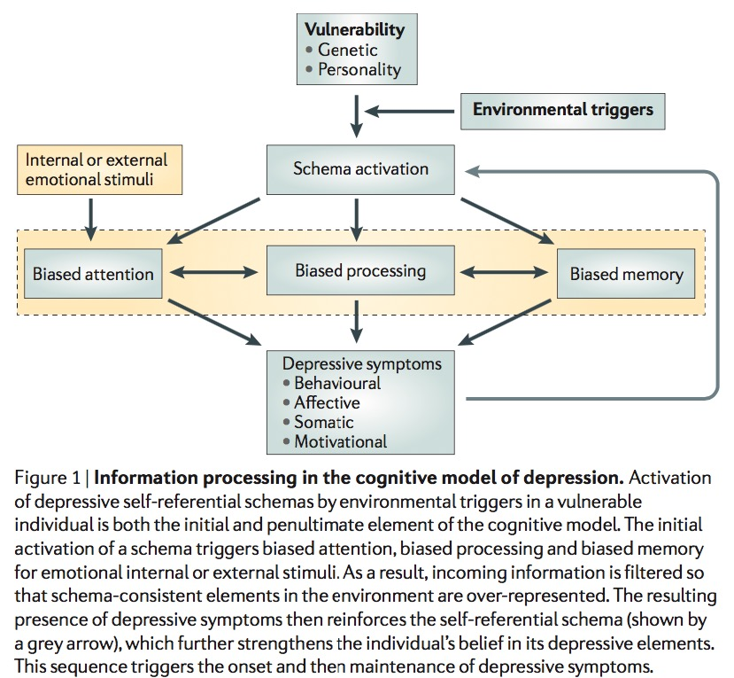

## [[@disner_neural_2011]](http://dx.doi.org/10.1038/nrn3027)

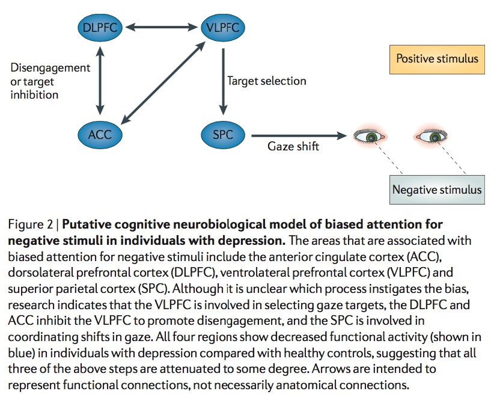

## [[@disner_neural_2011]](http://dx.doi.org/10.1038/nrn3027)

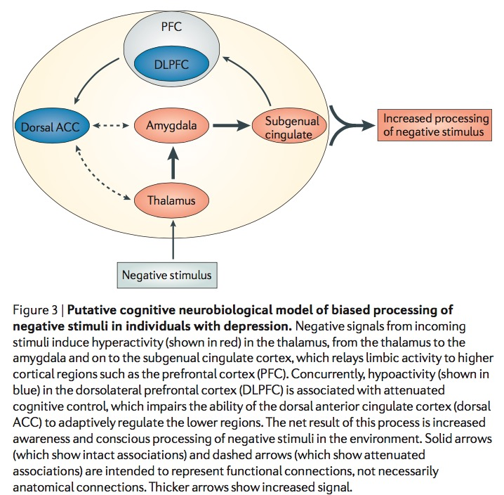

## Neurological factors

- Reduced hippocampal volumes
- [[@videbech2004hippocampal]](http://dx.doi.org/10.1176/appi.ajp.161.11.1957) meta-analysis

## [[@videbech2004hippocampal]](http://dx.doi.org/10.1176/appi.ajp.161.11.1957)

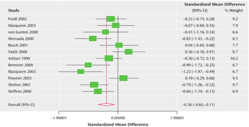

## [[@videbech2004hippocampal]](http://dx.doi.org/10.1176/appi.ajp.161.11.1957)

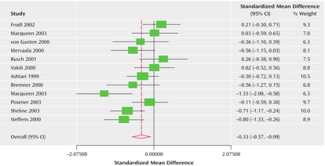

## Neurological factors

- Hypoactivity in
    + Frontal and temporal cortex
    + Anterior cingulate
    + Insula
    + Cerebellum
- [[@fitzgerald_meta-analytic_2008]](http://dx.doi.org/10.1002/hbm.20426)

## [[@fitzgerald_meta-analytic_2008]](http://dx.doi.org/10.1002/hbm.20426) {.smaller}

(a) patients v. controls, (b) patients on SSRIs, (c) patients v. ctrls (happy stim), (d) patients v. controls (sad stim)

## Neurological Factors

- Persistent activation in amygdala
- Amygdala and dorsolateral prefrontal cortex (DLPFC) inversely related
- [[@siegle_cant_2002]](http://dx.doi.org/10.1016/S0006-3223(02)01314-8)

## [[@siegle_cant_2002]](http://dx.doi.org/10.1016/S0006-3223(02)01314-8)

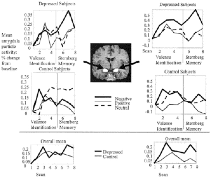

## [[@siegle_cant_2002]](http://dx.doi.org/10.1016/S0006-3223(02)01314-8)

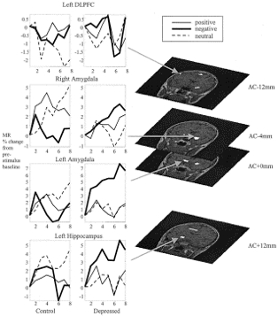

## Disrupted connectivity

- Resting state fMRI (rsFMRI) in 421 patients with major depressive disorder and 488 control subjects.
- Reduced connectivity between orbitofrontal cortex (OFC) and other areas of the brain
- Increased connectivity between lateral PFC and other brain areas

[[@cheng_medial_2016]](http://doi.org/10.1093/brain/aww255)

----

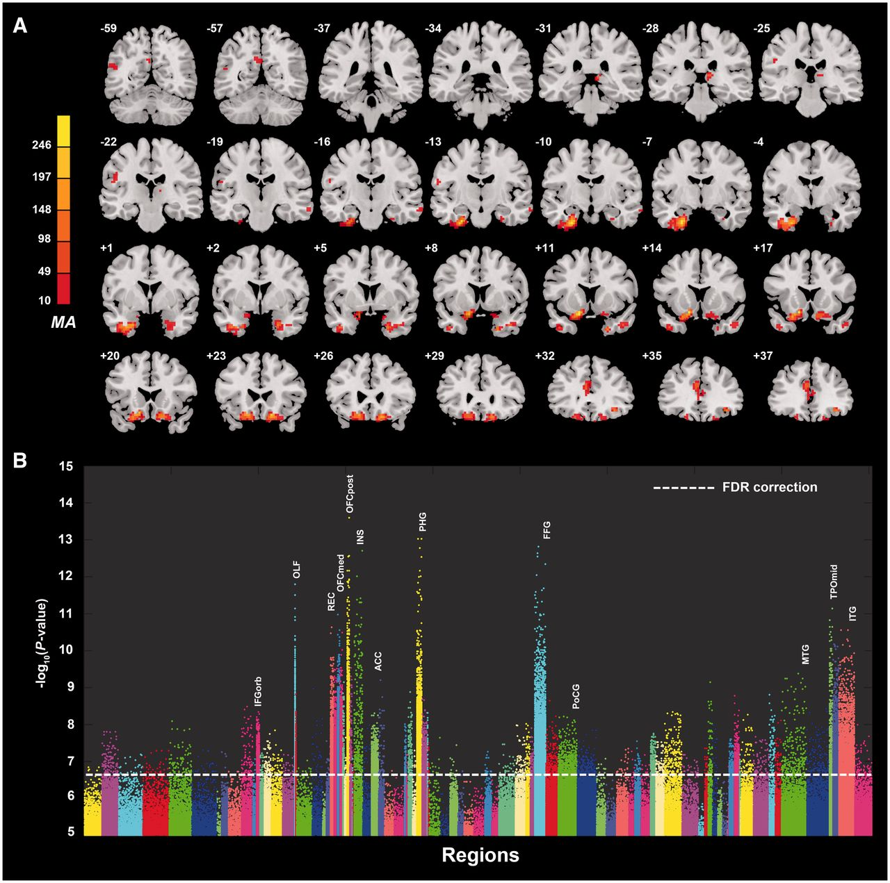

[[@cheng_medial_2016]](http://doi.org/10.1093/brain/aww255)

----

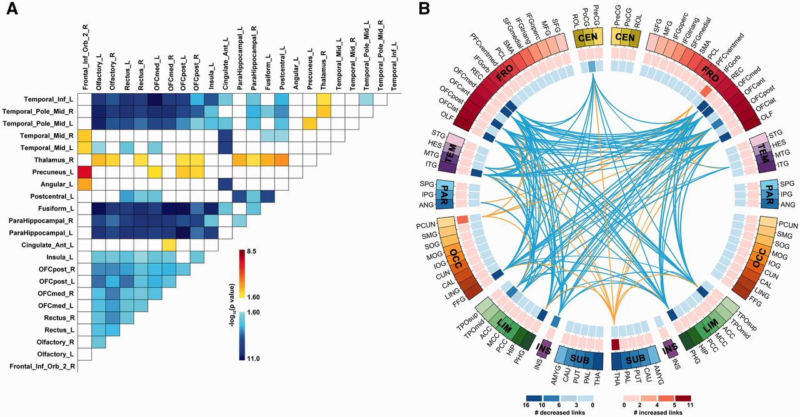

[[@cheng_medial_2016]](http://doi.org/10.1093/brain/aww255)

## Disturbed sleep

- Less slow wave (stage 3 and 4)/deep sleep 
- 75% insomnia, 40% hypersomnia, [[@nutt_sleep_2008]](http://www.ncbi.nlm.nih.gov/pmc/articles/PMC3181883/)

## Pharmacological factors

- Lowered thyroid function
- High/chronic cortisol levels 
- Monoamine hypothesis, [@schildkraut_catecholamine_1965]
    + More: euphoria
    + Less: depression
    + Resperine (antagonist for NE & 5-HT) can cause depression

## Pharmacological factors

- Serotonin hypothesis, [@coppen_biochemistry_1967].
    + Low serotonin (5-HT) metabolite levels in CSF of suicidal depressives [[@samuelsson_csf_2006]](http://dx.doi.org/10.1111/j.1600-0447.2005.00639.x)
    
## [[@samuelsson_csf_2006]](http://dx.doi.org/10.1111/j.1600-0447.2005.00639.x)

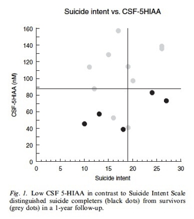

## Treatments for depression

- Psychotherapy
    + Often effective when combined with drug treatment
- Drugs
- Exercise
- [Electroconvulsive Shock (ECT)](http://www.nimh.nih.gov/health/topics/brain-stimulation-therapies/brain-stimulation-therapies.shtml)

## "First generation" drugs

- Monoamine oxidase (MAO) inhibitors (MAO-Is)
    + MAO destroys excess monoamines in terminal buttons
    + MAO-I’s boost monoamine levels
    + side effects may include "[serotonin syndrome](https://www.nlm.nih.gov/medlineplus/ency/article/007272.htm)"
        - Agitation or restlessness, + HR/resp/temp/BP, diarrhea/nausea/vomiting, loss of coordination
    
## "First generation" drugs

- Tricyclics
    + Inhibit NE, 5-HT reuptake
    + Upregulate monoamine levels
        + inhibit SERT and NET
    + but non-selective = side effects
        + BP/HR, dry mouth, constipation, drowsiness, anxiety
        + antagonists for 5-HT, NE, NMDA, histamine, and ACh receptors

## "Second and third generation" drugs

- Selective Serotonin Reuptake Inhibitors (SSRIs)
    + Block action of 5-HT transporter (SERT)
    + Fluoxetine (Prozac, Paxil, Zoloft)
    + Prolong duration 5-HT in synaptic cleft
    + Also increase brain steroid production
    
## Others

- Serotonin-Norepinephrine Reuptake Inhibitors (SNRIs)
    + e.g., Cymbalta, Effexor
- Norepinephrine reuptake inhibitors (NRI, NERI) or adrenergic reuptake inhibitors (ARI)
- Norepinephrine-Dopamine Reuptake Inhbitors (NDRIs)
    + e.g., Wellbutrin

## How well do the drugs work?

- [STAR*D trial](http://www.nimh.nih.gov/funding/clinical-research/practical/stard/allmedicationlevels.shtml)
- On SSRI for 12-14 weeks. ~1/3 achieved remission; 10-15% showed symptom reduction.
- If SSRI didn't work, could switch drugs. ~25% became symptom free.
- 16% of participants dropped out due to tolerability issues
- Took 6-7 weeks to show response.

## Who will benefit from drug therapy?

- Depends on
    + Early life stress
    + Brain (amygdala) response to emotional faces
- [[@goldstein-piekarski_human_2016]](http://doi.org/10.1073/pnas.1606671113)
- Low-stress + low amyg reactivity -> > responding
- High stress + high amyg reactivity -> > responding

----

[[@goldstein-piekarski_human_2016]](http://doi.org/10.1073/pnas.1606671113)

## Revisiting the serotonin hypothesis

- *The neurobiology of depression—revisiting the serotonin hypothesis. I. Cellular and molecular mechanisms*, <http://rstb.royalsocietypublishing.org/content/367/1601.toc>
- *The neurobiology of depression—revisiting the serotonin hypothesis. II. Genetic, epigenetic and clinical studies*, <http://rstb.royalsocietypublishing.org/content/368/1615>

## Problems with monoamine/5-HT hypothesis

- Too simplistic
- NE, 5-HT interact
- Drugs fast acting (min), but improvement slow (weeks)

## What do drugs do, then?

- Receptor sensitivity altered?
    + Presynaptic serotonin autoreceptors compensate
    + Postsynaptic upregulation of NE/5-HT effects
    + Link to neurotrophin BDNF, [[@duman_neurotrophic_2006]](http://dx.doi.org/10.1016/j.biopsych.2006.02.013)
    + BDNF boosts neurogenesis

## Exercise as a treatment

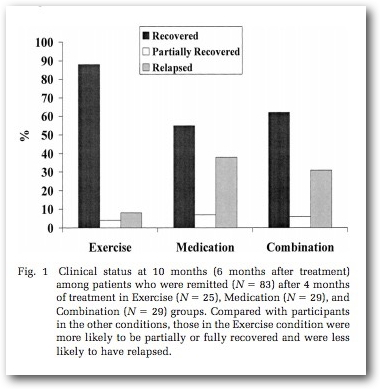

[[@babyak2000exercise]](http://journals.lww.com/psychosomaticmedicine/Abstract/2000/09000/Exercise_Treatment_for_Major_Depression_.6.aspx)

## Drugs vs. therapy

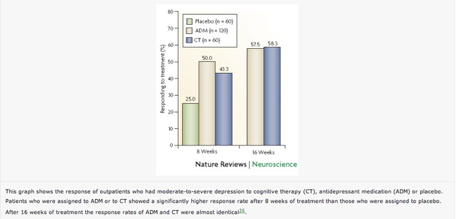

[[@derubeis_cognitive_2008]](http://dx.doi.org/10.1038/nrn2345)

## [[@derubeis_cognitive_2008]](http://dx.doi.org/10.1038/nrn2345)

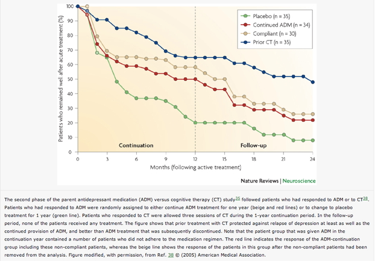

## [[@derubeis_cognitive_2008]](http://dx.doi.org/10.1038/nrn2345)

## [[@derubeis_cognitive_2008]](http://dx.doi.org/10.1038/nrn2345)

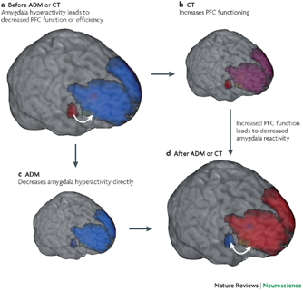

## Electroconvulsive Therapy (ECT)

- Last line of treatment for drug-resistant depression
- Remission rates of up to 50.9% [[@dierckx_efficacy_2012]](http://doi.org/10.1111/j.1399-5618.2012.00997.x)
- Seems to work via
    + Anticonvulsant (block Na+ channel or enhance GABA function) effects
    + Neurotrophic (stimulates neurogenesis) effects
    
## Neurogenesis hypothesis, [[@mahar_stress_2014]](http://doi.org/10.1016/j.neubiorev.2013.11.009)

- Chronic stress causes neural loss in hipp
- Chronic stress downregulates 5-HT sensitivity
- Depression ~ chronic stress
- Anti-depressants may upregulate neurogenesis via 5-HT modulation

## Depression's widespread impact

- Widespread brain dysfunction
- Prefrontal cortex, amygdala, HPA axis, circadian rhythms
- Genetic + environmental factors
- Disturbance in 5-HT, NE systems, cortisol

## Bipolar disorder

## The face of bipolar disorder

<iframe width="420" height="315" src="https://www.youtube.com/embed/GbIFLT9r9g8" frameborder="0" allowfullscreen></iframe>

## Bipolar disorder

- Formerly “manic depression” or “manic depressive disorder
- Alternating mood states
    + Mania or hypomania (milder form)
    + Depression
- Cycles 3-6 mos in length, but
    + Rapid cycling (weeks or days)
- Suicide risk 20-60x normal population, [[@baldessarini_suicide_2006]](http://dx.doi.org/10.1017/S1092852900014681) 

## Symptoms

<http://www.nimh.nih.gov/health/topics/bipolar-disorder/index.shtml>

## Prevalence, subtypes

- 1-3% prevalence
- Subtypes
    + Bipolar I: manic episodes, possible depressive ones
    + Bipolar II: no manic episodes but hypomania + depression

## Genetics

- Overlap between bipolar disorder and schizophrenia
- Genes for voltage-gated Ca++ channels
    + Regulate NT, hormone release, NMDA receptor effects
    + Gene expression, cell metabolism
- [[@craddock_genetics_2013]](http://dx.doi.org/10.1016/S0140-6736(13)60855-7)

## Brain responses to emotional faces ≠ depression

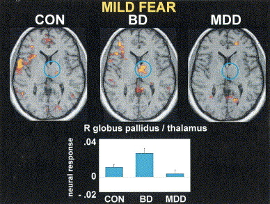

[[@lawrence_subcortical_2004]](http://dx.doi.org/10.1016/j.biopsych.2003.11.017)

## [[@lawrence_subcortical_2004]](http://dx.doi.org/10.1016/j.biopsych.2003.11.017)

## [[@lawrence_subcortical_2004]](http://dx.doi.org/10.1016/j.biopsych.2003.11.017)

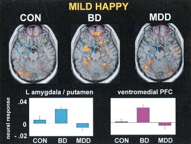

## Amyg, Hip volume reduced, 

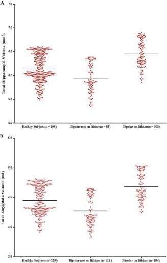

[[@hallahan_structural_2011]](http://dx.doi.org/10.1016/j.biopsych.2010.08.029)

## [[@hallahan_structural_2011]](http://dx.doi.org/10.1016/j.biopsych.2010.08.029)

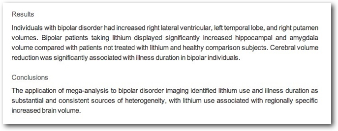

## Drug treatments

- Mood stabilizers
    + Lithium (Li)
    + Valproate 
- Anticonvulsants
    + GABA agonists
    + Usually to treat epilepsy
    + e.g. lamotrigine (Lamictal)
- Antipsychotics

## Effects of Lithium

- Reduces mania, minimal effects on depressive states
- Increases/preserves PFC, hip, amyg volume
- downregulates DA, glu; upregulates GABA
- modulates 5-HT, NE
- [[@malhi_potential_2013]](http://dx.doi.org/10.1007/s40263-013-0039-0)

## What does lithium do?

> At a neuronal level, lithium reduces excitatory (dopamine and glutamate) but increases inhibitory (GABA) neurotransmission; however, these broad effects are underpinned by complex neurotransmitter systems that strive to achieve homeostasis by way of compensatory changes. For example, at an intracellular and molecular level, lithium targets second-messenger systems that further modulate neurotransmission... 

[[@malhi_potential_2013]](http://dx.doi.org/10.1007/s40263-013-0039-0)

## An Unquiet Mind

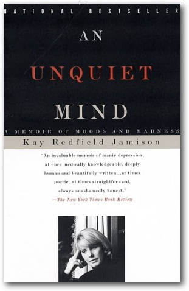

## BP summed-up

- Changes in mood, but ≠ depression
- Genetic + environmental risk
- Changes in emotion processing network activity, size of hippocampus
- But, heterogeneous
- No simple link to a specific NT system

## Postlude

<iframe width="560" height="315" src="https://www.youtube.com/embed/lioWzrpCtGQ" frameborder="0" allowfullscreen></iframe>

Video trailer of "Love and Mercy."

## References {.smaller}