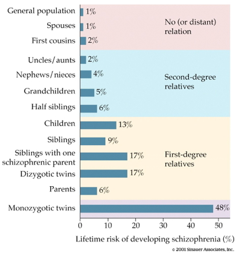
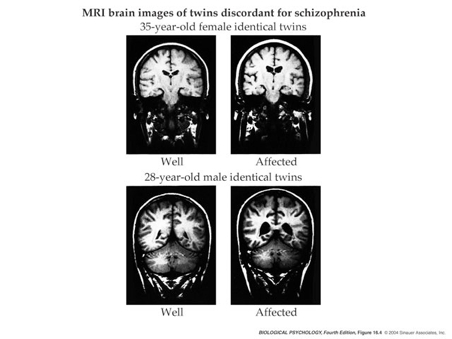
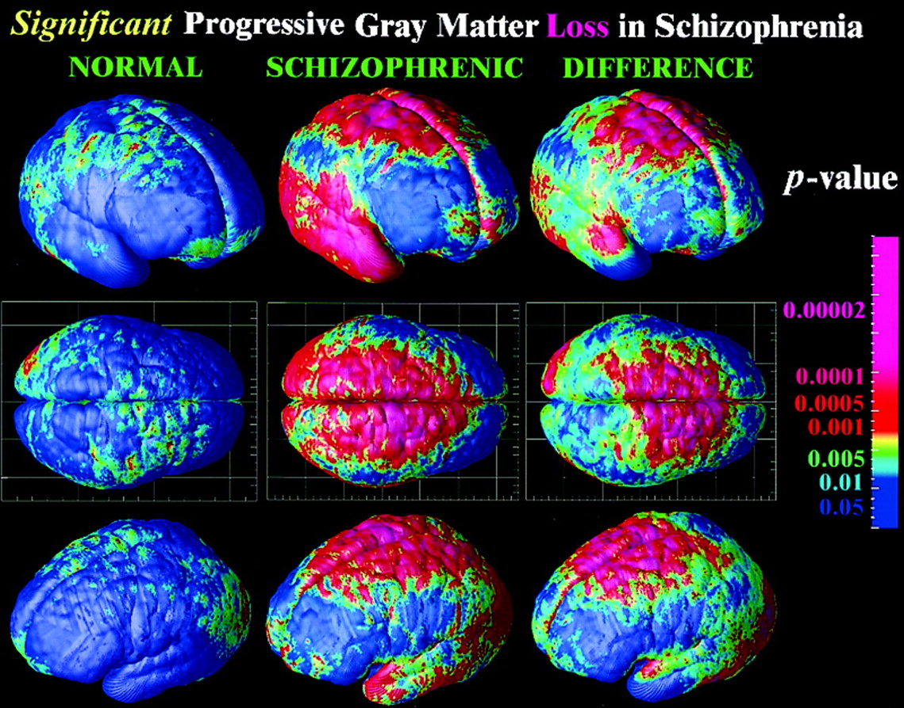

## Prelude

<iframe width="560" height="315" src="https://www.youtube.com/embed/lioWzrpCtGQ" frameborder="0" allowfullscreen></iframe>

## Prelude

<iframe width="420" height="315" src="https://www.youtube.com/embed/L0CVoFsUhC4" frameborder="0" allowfullscreen></iframe>

Maurice White and Earth, Wind, and Fire. Mr. White had Parkinson's.

## Prelude

<iframe width="420" height="315" src="https://www.youtube.com/embed/XaI5IRuS2aE" frameborder="0" allowfullscreen></iframe>

Woody Guthrie died from Huntington's Disease.

## Today's Topics

- Disorder and disease
    + [Bipolar disorder](https://rawgit.com/psu-psychology/psy-511-scan-fdns/master/lectures/511-2016-11-02.html#51)
    + Schizophrenia
    + Parkinson's
    + Huntington's
    
## The face of schizophrenia

<iframe width="420" height="315" src="https://www.youtube.com/embed/gGnl8dqEoPQ" frameborder="0" allowfullscreen></iframe>

## Overview

- Lifetime prevalence ~ 1/100
- 1/3 chronic & severe
- Onset post-puberty, early adulthood
- Pervasive disturbance in mood, thinking, movement, action, memory, perception

## Screening (Yale PRIME test)

1. I think that I have felt that there are odd or unusual things going on that I can’t explain.
2. I think that I might be able to predict the future.
3. I may have felt that there could possibly be something interrupting or controlling my thoughts, feelings, or actions. 

<http://www.schizophrenia.com/sztest/primetest.pdf>

## Screening (continued)

5. I get confused at times whether something I experience or perceive may be real or may be just part of my imagination or dreams. 
6. I have thought that it might be possible that other people can read my mind, or that I can read other’s minds.
7. I wonder if people may be planning to hurt me or even may be about to hurt me.

## Historical background

- Bleuler
    + Introduced “schizophrenia” or “split mind”
    + **Not** multiple personality disorder
- Kraeplin
    + Dementia Praecox and Paraphrenia (1919)
    + Emphasized developmental and hereditary origins

## "Positive" symptoms

- “Additions” to behavior
- Disordered thought
- Delusions of grandeur, persecution
- Hallucinations (usually auditory)
- Bizarre behavior

## "Negative" symptoms

- “Reductions” in behavior
- Poverty of speech
- Flat affect
- Social withdrawal
- Impaired executive function
- Anhedonia (loss of pleasure)
- Catatonia (reduced movement)

## Biological bases

- Genetic disposition
- Brain abnormalities
- Developmental origins

## Genetic disposition

## Genome-wide association studies (GWAS)

- [Psychiatric Genetics Consortium (PGC)](https://www.med.unc.edu/pgc) study
- 37K schizophrenia cases, 113K controls
- 108 loci, DRD2 receptor and Glu neurotransmission
- [[@schizophrenia_working_group_of_the_psychiatric_genomics_consortium_biological_2014]](http://doi.org/10.1038/nature13595)

## Ventricles larger, esp in males

## Hip and amyg smaller

- Related to ventricular enlargement?
- Early disturbance in brain development?

## Rapid gray matter loss in adolescents?

[[@thompson_mapping_2001]](http://dx.doi.org/10.1073/pnas.201243998)

## Dopamine hypothesis

- Excessive/overactive DA causes psychotic symptoms

----

## Evidence for DA hypothesis

- DA (D2 receptor -- DRD2) antagonists (e.g. chlorpromazine)
    + improve positive symptoms
- DA agonists
    + amphetamine, cocaine, L-DOPA
    + mimic or exacerbate symptoms

## Evidence against...

- New drugs 
    + (e.g. Clozapine) INCREASE DA in frontal cortex, effect 5-HT
- Mixed evidence for high DA metabolite levels in CSF
- Glutamate hypothesis
    + NMDA receptor antagonists (PCP, ketamine) induce psychosis
    + Underactivation of NMDA receptors?
    + NMDA receptor role in learning, plasticity

## Questioning "chemical imbalance"

*In short, we cannot afford to view our patients’ afflictions in the balkanized terms of “mental” vs. “physical”, “mind” vs. “body”, “psyche” vs. “soma”. Neither can we afford the luxury of supposing that only one type of treatment—medication or psychotherapy—will be effective for the illnesses we treat. On the contrary, the best available evidence suggests that each modality, or their synergistic combination, may be effective—depending on the specific illness.*

[[@pies2011psychiatry]](http://www.psychiatrictimes.com/blogs/couch-crisis/psychiatry-new-brain-mind-and-legend-chemical-imbalance)

## Schizophrenia summed up

- Wide-ranging disturbance of mood, thought, action, perception
- Broad changes in brain structure, function, chemistry
- Genetic risk + environmental factors
- ***"In psychiatry, conventional drug discovery is at an impasse1. In 2015, three (cariprazine, aripiprazole lauroxil, and brexpiprazole) out of 45 new drugs approved by FDA were related to psychiatry."*** [[@breen_translating_2016]](http://doi.org/10.1038/nn.4411)

## Neurodegenerative disorders

- Parkinson's
- Huntington's

## Parkinson's

Maurice White, Musician

## The Faces of Parkinson's

<iframe width="560" height="315" src="https://www.youtube.com/embed/CqEwPqUO1Bw" frameborder="0" allowfullscreen></iframe>

## Parkinson's

- Slow, absent movement, resting tremor
- Cognitive deficits, depression
- DA neurons in substantia nigra degenerate
- Treatments
    + DA agonists
    + [Deep brain stimulation](http://www.ninds.nih.gov/disorders/deep_brain_stimulation/deep_brain_stimulation.htm)
    + [Stem cells?](http://www.eurostemcell.org/factsheet/parkinson’s-disease-how-could-stem-cells-help)

## Huntington's

<http://cp91279.biography.com/1000509261001/1000509261001_1733824754001_woody-guthrie-centennial-1.jpg>

## The face of Huntington's

<iframe width="560" height="315" src="https://www.youtube.com/embed/HBLrY_nXU_U" frameborder="0" allowfullscreen></iframe>

## Huntington's

- Formerly Huntington’s Chorea
    + "Chorea" from Greek for "dance"
    + “Dance-like” pattern of involuntary movements
- Cognitive decline
- Child onset >> severity than adult

## Huntington's

- Genetic factors
    + HTT gene
    + autosomal dominant (need from 1 parent only)
    + CAG trinucleotide repeats, more -> greater risk
- Disturbance in striatum
- No effective treatment

## Next week...

- Exams due by start of class on Friday, November 10.

## References {.smaller}
